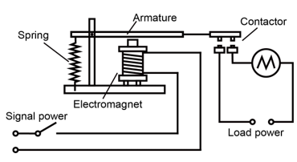
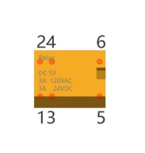
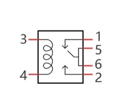
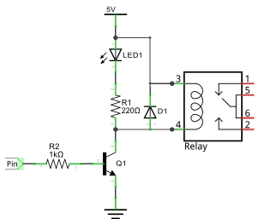
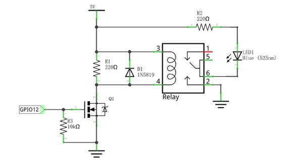
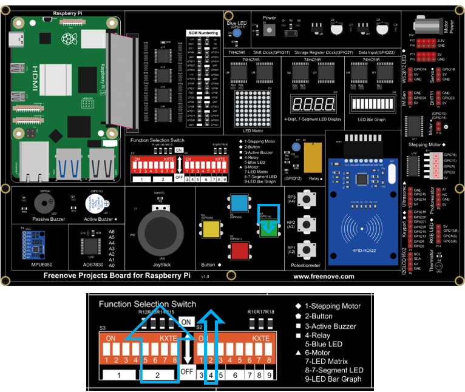

##############################################################################
Chapter Relay & LED
##############################################################################

In this chapter, we will learn a kind of special switch module, Relay Module.

Project 12.1 Relay & LED
****************************************************************

Component knowledge
================================================================

Relay
----------------------------------------------------------------

Relays are a type of Switch that open and close circuits electromechanically or electronically. Relays control one electrical circuit by opening and closing contacts in another circuit using an electromagnet to initiate the Switch action. When the electromagnet is energized (powered), it will attract internal contacts completing a circuit, which act as a Switch. Many times Relays are used to allow a low powered circuit (and a small low amperage switch) to safely turn ON a larger more powerful circuit. They are commonly found in automobiles, especially from the ignition to the starter motor.

The following is a basic diagram of a common Relay and the image and circuit symbol diagram of the 5V relay used in this project:

.. list-table:: 
    :width: 100%
    :align: center
    :class: product-table

    *   -   Diagram 
        -   Feature:
        -   Symbol
    
    *   -   |Chapter12_00|
        -   |Chapter12_01|
        -   |Chapter12_02|

Pin 5 and pin 6 are internally connected to each other. When the coil pin3 and pin 4 are connected to a 5V power supply, pin 1 will be disconnected from pins 5 & 6 and pin 2 will be connected to pins 5 & 6. Pin 1 is called Closed End and pin 2 is called the Open End.

Inductor
----------------------------------------------------------------

The symbol of Inductance is “L” and the unit of inductance is the “Henry” (H). Here is an example of how this can be encountered: 1H=1000mH, 1mH=1000μH.

An Inductor is a passive device that stores energy in its Magnetic Field and returns energy to the circuit whenever required. An Inductor is formed by a Cylindrical Core with many Turns of conducting wire (usually copper wire). Inductors will hinder the changing current passing through it. When the current passing through the Inductor increases, it will attempt to hinder the increasing movement of current; and when the current passing through the inductor decreases, it will attempt to hinder the decreasing movement of current. So the current passing through an Inductor is not transient.

The circuit for a Relay is as follows: The coil of Relay can be equivalent to an Inductor, when a Transistor is present in this coil circuit it can disconnect the power to the relay, the current in the Relay’s coil does not stop immediately, which affects the power supply adversely. To remedy this, diodes in parallel are placed on both ends of the Relay coil pins in opposite polar direction. Having the current pass through the diodes will avoid any adverse effect on the power supply.

Component List
================================================================

+------------------------------------------+
| Freenove Projects Board for Raspberry Pi |
|                                          |
|  |Chapter01_04|                          |
+---------------------+--------------------+
| Raspberry Pi        | GPIO Ribbon Cable  |
|                     |                    |
|  |Chapter01_05|     |  |Chapter01_06|    |
+---------------------+--------------------+

.. |Chapter01_04| image:: ../_static/imgs/1_LED/Chapter01_04.png
.. |Chapter01_05| image:: ../_static/imgs/1_LED/Chapter01_05.png
.. |Chapter01_06| image:: ../_static/imgs/1_LED/Chapter01_06.png

Circuit
================================================================

.. list-table:: 
    :width: 100%
    :align: center
    :class: product-table

    *   -   Schematic diagram
    *   -   |Chapter12_05|
    *   -   Hardware connection:
    *   -   |Chapter12_06|

.. note::
    
    :red:`If you have any concerns, please send an email to:` support@freenove.com

Code 
================================================================

C Code 12.1 Relay
----------------------------------------------------------------

First, observe the project result, and then learn about the code in detail.

.. note::
    
    :red:`If you have any concerns, please send an email to:` support@freenove.com

1.	Use cd command to enter 12_Relay directory of C code.

.. code-block:: console

    $ cd ~/Freenove_Kit/Code/C_Code/12_Relay

2.	Use following command to compile "Relay.c" and generate executable file "Relay". 

.. code-block:: console

    $ gcc Relay.c -o Relay -lwiringPi

3.	Run the generated file "Relay".

.. code-block:: console

    $ ./Relay

After running the program, press the button, the LED near relay will light up.

Press the button again, the LED will light OFF.

The following is the program code:

.. literalinclude:: ../../../freenove_Kit/Code/C_Code/12_Relay/Relay.c
    :linenos: 
    :language: c

Python Code 12.1 Relay
----------------------------------------------------------------

First observe the project result, and then learn about the code in detail.

If you have any concerns, please send an email to: support@freenove.com

1.	Use cd command to enter 12_Relay directory of Python code.

.. code-block:: console

    $ cd ~/Freenove_Kit/Code/Python_GPIOZero_Code/12_Relay

2.	Use python command to execute code "Relay.py". 

.. code-block:: console

    $ python Relay.py

After running the program, press the button, the LED near relay will light up.

Press the button again, the LED will light OFF.

The following is the program code:

.. literalinclude:: ../../../freenove_Kit/Code/Python_GPIOZero_Code/12_Relay/Relay.py
    :linenos: 
    :language: python
