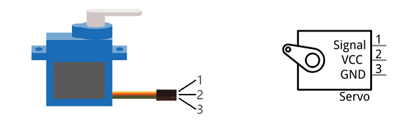
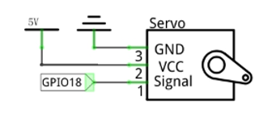
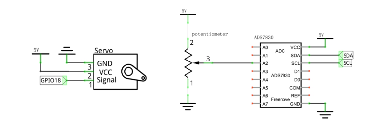

##############################################################################
Chapter Servo
##############################################################################

Previously, we learned how to control the speed and rotational direction of a DC Motor. In this chapter, we will learn about Servos which are a rotary actuator type motor that can be controlled rotate to specific angles.

Project 13.1 Sweep
****************************************************************

First, we need to learn how to make a Servo rotate.

Component knowledge
================================================================

Servo
----------------------------------------------------------------

Servo is a compact package which consists of a DC Motor, a set of reduction gears to provide torque, a sensor and control circuit board. Most Servos only have a 180-degree range of motion via their “horn”. Servos can output higher torque than a simple DC Motor alone and they are widely used to control motion in model cars, model airplanes, robots, etc. Servos have three wire leads which usually terminate to a male or female 3-pin plug. Two leads are for electric power: Positive (2-VCC, Red wire), Negative (3-GND, Brown wire), and the signal line (1-Signal, Orange wire) as represented in the Servo provided in your Kit.

We will use a 50Hz PWM signal with a duty cycle in a certain range to drive the Servo. The lasting time 0.5ms-2.5ms of PWM single cycle high level corresponds to the Servo angle 0 degrees - 180 degree linearly. Part of the corresponding values are as follows:

.. note:: 
    
    the lasting time of high level corresponding to the servo angle is absolute instead of accumulating. For example, the high level time lasting for 0.5ms correspond to the 0 degree of the servo. If the high level time lasts for another 1ms, the servo rotates to 45 degrees.

.. list-table::
    :align: center

    *  - High level time
       - Servo angle
    
    *  - 0.5ms
       - 0 degree
    
    *  - 1ms
       - 45 degree

    *  - 1.5ms
       - 90 degree

    *  - 2ms
       - 135 degree

    *  - 2.5ms
       - 180 degree

When you change the Servo signal value, the Servo will rotate to the designated angle.

Component List
================================================================

+---------------------------------------------+
| Freenove Projects Board for Raspberry Pi    |
|                                             |
|  |Chapter01_04|                             |
+---------------------+-----------------------+
| Raspberry Pi        | GPIO Ribbon Cable     |
|                     |                       |
|  |Chapter01_05|     |  |Chapter01_06|       |
+---------------------+-----------------------+
| Jumper Wire         | Servo                 |
|                     |                       |
|  |Chapter05_02|     |  |Chapter13_01|       |
+---------------------+-----------------------+

.. |Chapter01_04| image:: ../_static/imgs/1_LED/Chapter01_04.png
.. |Chapter01_05| image:: ../_static/imgs/1_LED/Chapter01_05.png
.. |Chapter01_06| image:: ../_static/imgs/1_LED/Chapter01_06.png
.. |Chapter05_02| image:: ../_static/imgs/5_RGB_LED/Chapter05_02.png
.. |Chapter13_01| image:: ../_static/imgs/13_Servo/Chapter13_01.png

Circuit
================================================================

.. list-table:: 
    :width: 100%
    :align: center
    :class: product-table

    *   -   Schematic diagram
    *   -   |Chapter13_02|
    *   -   Hardware connection:
    *   -   |Chapter13_03|

.. |Chapter13_03| image:: ../_static/imgs/13_Servo/Chapter13_03.png

.. note::
    
    :red:`If you have any concerns, please send an email to:` support@freenove.com

Code
================================================================

In this project, we will make a Servo rotate from 0 degrees to 180 degrees and then reverse the direction to make it rotate from 180 degrees to 0 degrees and repeat these actions in an endless loop.

C Code 13.1 Sweep
----------------------------------------------------------------

First, observe the project result, and then learn about the code in detail.

.. note::
    
    :red:`If you have any concerns, please send an email to:` support@freenove.com

1.	Use cd command to enter 13_1_Sweep directory of C code.

.. code-block:: console

    $ cd ~/Freenove_Kit/Code/C_Code/13_1_Sweep

2.	Use following command to compile "Sweep.c" and generate executable file "Sweep". 

.. code-block:: console

    $ gcc Sweep.c -o Sweep -lwiringPi

3.	Run the generated file "Sweep".

.. code-block:: console

    $ ./Sweep

After the program runs, the Servo will rotate from 0 degrees to 180 degrees and then reverse the direction to make it rotate from 180 degrees to 0 degrees and repeat these actions in an endless loop.

The following is the program code:

.. literalinclude:: ../../../freenove_Kit/Code/C_Code/13_1_Sweep/Sweep.c
    :linenos: 
    :language: c

A 50 Hz pulse for a 20ms cycle is required to control the Servo. In function softPwmCreate (int pin, int initialValue, int pwmRange), the unit of the third parameter pwmRange is 100US, specifically 0.1ms. In order to get the PWM with a 20ms cycle, the pwmRange shoulde be set to 200. So in the subfunction of servoInit (), we create a PWM pin with a pwmRange of 200.

.. literalinclude:: ../../../freenove_Kit/Code/C_Code/13_1_Sweep/Sweep.c
    :linenos: 
    :language: c
    :lines: 18-20

Since 0-180 degrees of the Servo's motion corresponds to the PWM pulse width of 0.5-2.5ms, with a PwmRange of 200 ms, we then need the function **softPwmWrite** (int pin, int value) and the scope 5-25 of the parameter values to correspond to 0-180 degrees' motion of the Servo. What's more, the number written in subfunction **servoWriteMS** () should be within the range of 5-25. However, in practice, due to the inherent error manufactured into each Servo, the pulse width will have a deviation. So we need to define a minimum and maximum pulse width and an error offset (this is essential in robotics).

.. literalinclude:: ../../../freenove_Kit/Code/C_Code/13_1_Sweep/Sweep.c
    :linenos: 
    :language: c
    :lines: 7-12, 28-34

In subfunction **servoWrite** (), directly input an angle value (0-180 degrees), map the angle to the pulse width and then output it.

.. literalinclude:: ../../../freenove_Kit/Code/C_Code/13_1_Sweep/Sweep.c
    :linenos: 
    :language: c
    :lines: 21-27

Finally, in the "while" loop of the main function, use two "for" loop to make servo rotate from 0 degrees to 180 degrees, and then from 180 degrees to 0 degrees.

.. literalinclude:: ../../../freenove_Kit/Code/C_Code/13_1_Sweep/Sweep.c
    :linenos: 
    :language: c
    :lines: 44-55

Python Code 13.1 Sweep
----------------------------------------------------------------

First observe the project result, and then learn about the code in detail.

If you have any concerns, please send an email to: support@freenove.com

1.	Use cd command to enter 13_1_Sweep directory of Python code.

.. code-block:: console

    $ cd ~/Freenove_Kit/Code/Python_GPIOZero_Code/13_1_Sweep

2.	Use python command to execute code "Sweep.py".

.. code-block:: console

    $ python Sweep.py

After the program runs, the Servo will rotate from 0 degrees to 180 degrees and then reverse the direction to make it rotate from 180 degrees to 0 degrees and repeat these actions in an endless loop.

The following is the program code:

.. literalinclude:: ../../../freenove_Kit/Code/Python_GPIOZero_Code/13_1_Sweep/Sweep.py
    :linenos: 
    :language: python

We use angles to control the servo, so we need to configure the parameters of the steering gear first. 

The time unit of the pulse is seconds.

.. literalinclude:: ../../../freenove_Kit/Code/Python_GPIOZero_Code/13_1_Sweep/Sweep.py
    :linenos: 
    :language: python
    :lines: 16-16

As 0-180 degrees of the Servo's rotation corresponds to the PWM pulse width 0.5-2.5ms within cycle 20ms.

However, in practice, due to the inherent error manufactured into each Servo, the pulse width will have a deviation. So we need to define a minimum and maximum pulse width and an error offset (this is essential in robotics). 

.. literalinclude:: ../../../freenove_Kit/Code/Python_GPIOZero_Code/13_1_Sweep/Sweep.py
    :linenos: 
    :language: python
    :lines: 13-15

Please note that the servo angle value should range from 0 to 180 degrees.

.. literalinclude:: ../../../freenove_Kit/Code/Python_GPIOZero_Code/13_1_Sweep/Sweep.py
    :linenos: 
    :language: python
    :lines: 20-22

Finally, in the "while" loop of main function, we need to use two separate cycles to make servo rotate from 0 degrees to 180 degrees and then from 180 degrees to 0 degrees. 

.. literalinclude:: ../../../freenove_Kit/Code/Python_GPIOZero_Code/13_1_Sweep/Sweep.py
    :linenos: 
    :language: python
    :lines: 18-27

Project 13.2 Knob
****************************************************************

In this project, we will learn how to control the servo with a potentiometer.

Component List
================================================================

+---------------------------------------------+
| Freenove Projects Board for Raspberry Pi    |
|                                             |
|  |Chapter01_04|                             |
+---------------------+-----------------------+
| Raspberry Pi        | GPIO Ribbon Cable     |
|                     |                       |
|  |Chapter01_05|     |  |Chapter01_06|       |
+---------------------+-----------------------+
| Jumper Wire         | Servo                 |
|                     |                       |
|  |Chapter05_02|     |  |Chapter13_01|       |
+---------------------+-----------------------+

Circuit
================================================================

.. list-table:: 
    :width: 100%
    :align: center
    :class: product-table

    *   -   Schematic diagram
    *   -   |Chapter13_04|
    *   -   Hardware connection:
    *   -   |Chapter13_05|

.. note::
    
    :red:`If you have any concerns, please send an email to:` support@freenove.com

Code
================================================================

In this project, we will make a Servo rotate from 0 degrees to 180 degrees and then reverse the direction to make it rotate from 180 degrees to 0 degrees and repeat these actions in an endless loop.

C Code 13.2 Knob
----------------------------------------------------------------

First, observe the project result, and then learn about the code in detail.

.. note::
    
    :red:`If you have any concerns, please send an email to:` support@freenove.com

1.	Use cd command to enter 13_2_Knob directory of C code.

.. code-block:: console

    $ cd ~/Freenove_Kit/Code/C_Code/13_2_Knob

2.	Use following command to compile " Knob.cpp" and generate executable file " Knob". 

.. code-block:: console

    $ g++ Knob.cpp -o Knob -lwiringPi -lADCDevice

3.	Run the generated file " Knob ".

.. code-block:: console

    $ ./Knob

After running the program, you can change the angle of the servo by rotating the potentiometer.

The following is the program code:

.. literalinclude:: ../../../freenove_Kit/Code/C_Code/13_2_Knob/Knob.cpp
    :linenos: 
    :language: c
Read the ADC value of channle2, and then the servo will rotate to corresponding angle.

.. literalinclude:: ../../../freenove_Kit/Code/C_Code/13_2_Knob/Knob.cpp
    :linenos: 
    :language: c
    :lines: 59-64

Python Code 13.2 Knob
----------------------------------------------------------------

First observe the project result, and then learn about the code in detail.

.. note::
    
    :red:`If you have any concerns, please send an email to:` support@freenove.com

1.	Use cd command to enter 13_2_Knob directory of Python code.

.. code-block:: console

    $ cd ~/Freenove_Kit/Code/Python_GPIOZero_Code/13_2_Knob

2.	Use python command to execute code " Knob.py".

.. code-block:: console

    $ python Knob.py

After running the program, you can change the angle of the servo by rotating the potentiometer.

The following is the program code:

.. literalinclude:: ../../../freenove_Kit/Code/Python_GPIOZero_Code/13_2_Knob/Knob.py
    :linenos: 
    :language: python

Read the ADC value of channle2, and then the servo will rotate to corresponding angle.

.. literalinclude:: ../../../freenove_Kit/Code/Python_GPIOZero_Code/13_2_Knob/Knob.py
    :linenos: 
    :language: python
    :lines: 42-46