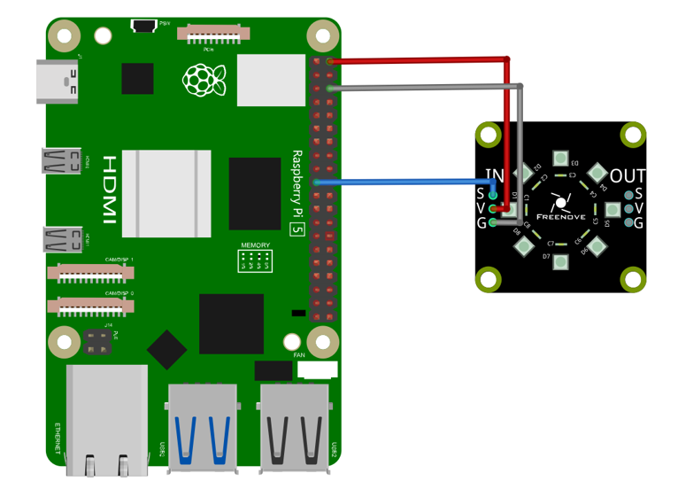

##############################################################################
Chapter LEDpixel
##############################################################################

In this chapter, we will learn Freenove 8 RGB LED Module.

.. note::
    
    if your Raspberry Pi is Raspberry Pi5, skip 15.1 and 15.2 and look at 15.3 instead. Because 15.1 and 15.2 use the rpi_ws2812 library, they are not compatible with Raspberry Pi5.

Since rpi libraries do not work on bookworm systems, skip 15.1 and 15.2 if you are using that system. 15.3 Use spi to drive the color lights.

Project 15.1 LEDpixel
****************************************************************

This project will achieve an RGB triple colored flowing water. 

Component knowledge
================================================================

Freenove 8 RGB LED Module
----------------------------------------------------------------

The Freenove 8 RGB LED Module is as below. You can use only one data pin to control the eight LEDs on the module. As shown below:

And you can also control many modules at the same time. Just connect OUT pin of one module to IN pin of another module. In such way, you can use one data pin to control 8, 16, 32 … LEDs.

Pin description:

+---------------------------------------+---------------------------------------+
|                 (IN)                  |                    (OUT)              |
+--------+------------------------------+--------+------------------------------+
| symbol | Function                     | symbol | Function                     |
+--------+------------------------------+--------+------------------------------+
| S      | Input control signal         | S      | Output control signal        |
+--------+------------------------------+--------+------------------------------+
| V      | Power supply pin, +3.5V~5.5V | V      | Power supply pin, +3.5V~5.5V |
+--------+------------------------------+--------+------------------------------+
| G      | GND                          | G      | GND                          |
+--------+------------------------------+--------+------------------------------+

Component List
================================================================

+------------------------------------------------+
| Freenove Projects Board for Raspberry Pi       |
|                                                |
|  |Chapter01_04|                                |
+---------------------+--------------------------+
| Raspberry Pi        | GPIO Ribbon Cable        |
|                     |                          |
|  |Chapter01_05|     |  |Chapter01_06|          |
+---------------------+--------------------------+
| Jumper Wire         | Freenove 8 RGB LED Module|
|                     |                          |
|  |Chapter05_02|     |  |Chapter15_02|          |
+---------------------+--------------------------+

.. |Chapter01_04| image:: ../_static/imgs/1_LED/Chapter01_04.png
.. |Chapter01_05| image:: ../_static/imgs/1_LED/Chapter01_05.png
.. |Chapter01_06| image:: ../_static/imgs/1_LED/Chapter01_06.png
.. |Chapter05_02| image:: ../_static/imgs/5_RGB_LED/Chapter05_02.png

Circuit
================================================================

.. list-table:: 
    :width: 100%
    :align: center
    :class: product-table

    *   -   Schematic diagram
    *   -   |Chapter15_03|
    *   -   Hardware connection:
    *   -   |Chapter14_06|

.. note::
    
    :red:`If you have any concerns, please send an email to:` support@freenove.com

Code
================================================================

C Code 15.1 Ledpixel
----------------------------------------------------------------

Before running C code, please install WS281X library.

1.	Enter the directory where the library locates:

.. code-block:: console

    $ cd ~/Freenove_Kit/Libs/C-Libs/libWS281X

2.	Run the program

.. code-block:: console

    $ sudo sh ./build.sh

The installation is completed as shown in the figure below

First, observe the project result, and then learn about the code in detail.

.. note::
    
    :red:`If you have any concerns, please send an email to:` support@freenove.com

1.	Use cd command to enter 15_1_Ledpixel directory of C code.

.. code-block:: console

    $ cd ~/Freenove_Kit/Code/C_Code/15_1_Ledpixel

2.	Use following command to compile " Ledpixel.cpp" and generate executable file "Ledpixel". 

.. code-block:: console

    $ sudo g++ Ledpixel.cpp -o Ledpixel -lwiringPi -lWS281X

3.	Run the generated file " Ledpixel".

.. code-block:: console

    $ sudo ./Ledpixel

After the program runs, the LEDpixel will emit red, blue and green colors in turn like flowing water.

The following is the program code:

.. literalinclude:: ../../../freenove_Kit/Code/C_Code/15_1_Ledpixel/Ledpixel.cpp
    :linenos: 
    :language: c

Include "Freenove_WS2812_Lib_for_Raspberry_Pi.hpp"

.. code-block:: c

    #include "Freenove_WS2812_Lib_for_Raspberry_Pi.hpp"

Create the object of the class and set the brightness to 50%. The eight LEDs will then light up red, green and blue in turn.

.. literalinclude:: ../../../freenove_Kit/Code/C_Code/15_1_Ledpixel/Ledpixel.cpp
    :linenos: 
    :language: c
    :lines: 21-46

Python Code 15.1 Ledpixel
----------------------------------------------------------------

Before running python code, please install WS281X library first.

1.	Enter the following command to install.

.. code-block:: console

    $ sudo pip3 install rpi_ws281x

The installation is completed as shown in the figure below.

First, observe the project result, and then learn about the code in detail.

.. note::
    
    :red:`If you have any concerns, please send an email to:` support@freenove.com

1.	Use cd command to enter 15_1_Ledpixel directory of Python code.

.. code-block:: console

    $ cd ~/Freenove_Kit/Code/Python_GPIOZero_Code/15_1_Ledpixel

2.	Use python command to execute code "Sweep.py".

.. code-block:: console

    $ sudo python Led.py

After the program runs, the LEDpixel will emit red, green and blue colors in turn like flowing water.

The following is the program code:

.. literalinclude:: ../../../freenove_Kit/Code/Python_GPIOZero_Code/15_1_Ledpixel/Led.py
    :linenos: 
    :language: python

Import rpi_ws281x modile. Set the number, pins and brightness of the LED.

.. literalinclude:: ../../../freenove_Kit/Code/Python_GPIOZero_Code/15_1_Ledpixel/Led.py
    :linenos: 
    :language: python
    :lines: 10-18

Define LED class.

.. literalinclude:: ../../../freenove_Kit/Code/Python_GPIOZero_Code/15_1_Ledpixel/Led.py
    :linenos: 
    :language: python
    :lines: 20-29

Light up the eight LEDs in red, green and blue in turn.

.. literalinclude:: ../../../freenove_Kit/Code/Python_GPIOZero_Code/15_1_Ledpixel/Led.py
    :linenos: 
    :language: python
    :lines: 36-47

Project 15.2 Rainbow Light
****************************************************************

In this project, we will learn to control the LED module with a potentiometer.

Component List
================================================================

+------------------------------------------------+
| Freenove Projects Board for Raspberry Pi       |
|                                                |
|  |Chapter01_04|                                |
+---------------------+--------------------------+
| Raspberry Pi        | GPIO Ribbon Cable        |
|                     |                          |
|  |Chapter01_05|     |  |Chapter01_06|          |
+---------------------+--------------------------+
| Jumper Wire         | Freenove 8 RGB LED Module|
|                     |                          |
|  |Chapter05_02|     |  |Chapter15_02|          |
+---------------------+--------------------------+

Circuit
================================================================

.. list-table:: 
    :width: 100%
    :align: center
    :class: product-table

    *   -   Schematic diagram
    *   -   |Chapter15_07|
    *   -   Hardware connection:
    *   -   |Chapter15_08|

.. |Chapter15_07| image:: ../_static/imgs/15_LEDpixel/Chapter15_07.png

.. note::
    
    :red:`If you have any concerns, please send an email to:` support@freenove.com

Code
================================================================

C Code 15.2 Rainbow Light
----------------------------------------------------------------

First, observe the project result, and then learn about the code in detail.

.. note::
    
    :red:`If you have any concerns, please send an email to:` support@freenove.com

1.	Use cd command to enter 15_2_RainbowLight directory of C code.

.. code-block:: console

    $ cd ~/Freenove_Kit/Code/C_Code/15_2_RainbowLight

2.	Use following command to compile " RainbowLight.cpp " and generate executable file " RainbowLight ". 

.. code-block:: console

    $ sudo g++ RainbowLight.cpp -o RainbowLight -lwiringPi -lWS281X -lADCDevice

3.	Run the generated file " RainbowLight ".

.. code-block:: console

    $ sudo ./RainbowLight

After running the program, you can change the color of the LED module by rotating the potentiometer.

The following is the program code:

.. literalinclude:: ../../../freenove_Kit/Code/C_Code/15_2_RainbowLight/RainbowLight.cpp
    :linenos: 
    :language: c

This function converts HSL colors to RGB colors.

.. literalinclude:: ../../../freenove_Kit/Code/C_Code/15_2_RainbowLight/RainbowLight.cpp
    :linenos: 
    :language: c
    :lines: 16-35

Read the ADC value of channel 2 in an infinite loop. Let the color of the eight LEDs change according to the value of the ADC.

.. literalinclude:: ../../../freenove_Kit/Code/C_Code/15_2_RainbowLight/RainbowLight.cpp
    :linenos: 
    :language: c
    :lines: 56-67

Python Code 15.2 Rainbow Light
----------------------------------------------------------------

First observe the project result, and then learn about the code in detail.

.. note::
    
    :red:`If you have any concerns, please send an email to:` support@freenove.com

1.	Use cd command to enter 15.2 Rainbow Light directory of Python code.

.. code-block:: console

    $ cd ~/Freenove_Kit/Code/Python_GPIOZero_Code/15_2_RainbowLight

2.	Use python command to execute code " Led.py ".

.. code-block:: console

    $ sudo python Led.py

After running the program, you can change the color of the LED module by rotating the potentiometer.

The following is the program code:

.. literalinclude:: ../../../freenove_Kit/Code/Python_GPIOZero_Code/15_2_RainbowLight/Led.py
    :linenos: 
    :language: python

This function converts HSL colors to RGB colors.

.. literalinclude:: ../../../freenove_Kit/Code/Python_GPIOZero_Code/15_2_RainbowLight/Led.py
    :linenos: 
    :language: python
    :lines: 40-56

Read the ADC value of channel 2 in an infinite loop. Let the color of the eight LEDs change according to the value of the ADC.

.. literalinclude:: ../../../freenove_Kit/Code/Python_GPIOZero_Code/15_2_RainbowLight/Led.py
    :linenos: 
    :language: python
    :lines: 62-70

Project 15.3 SpiLEDpixel
****************************************************************

+---------------------+--------------------------+
| Raspberry Pi        | Jumper Wire              |
|                     |                          |
|  |Chapter01_05|     |  |Chapter05_02|          |
+---------------------+--------------------------+
| Freenove 8 RGB LED Module                      |
|                                                |
|  |Chapter15_02|                                |
+------------------------------------------------+

.. |Chapter01_05| image:: ../_static/imgs/1_LED/Chapter01_05.png
.. |Chapter05_02| image:: ../_static/imgs/5_RGB_LED/Chapter05_02.png

Component knowledge
================================================================

Freenove 8 RGB LED Module
----------------------------------------------------------------

The Freenove 8 RGB LED Module is as below. You can use only one data pin to control the eight LEDs on the module. As shown below:

And you can also control many modules at the same time. Just connect OUT pin of one module to IN pin of another module. In such way, you can use one data pin to control 8, 16, 32 … LEDs.

Pin description:

+---------------------------------------+---------------------------------------+
|                 (IN)                  |                    (OUT)              |
+--------+------------------------------+--------+------------------------------+
| symbol | Function                     | symbol | Function                     |
+--------+------------------------------+--------+------------------------------+
| S      | Input control signal         | S      | Output control signal        |
+--------+------------------------------+--------+------------------------------+
| V      | Power supply pin, +3.5V~5.5V | V      | Power supply pin, +3.5V~5.5V |
+--------+------------------------------+--------+------------------------------+
| G      | GND                          | G      | GND                          |
+--------+------------------------------+--------+------------------------------+

Circuit
================================================================

.. list-table:: 
    :width: 100%
    :align: center
    :class: product-table

    *   -   Schematic diagram
    *   -   |Chapter15_09|
    *   -   Hardware connection:
    *   -   |Chapter15_10|

.. note::
    
    :red:`If you have any concerns, please send an email to:` support@freenove.com

Before you run your python code, check that the spidev library exists.

Enter the following command to install.

.. code-block:: console

    $ pip list

The spidev is installed on Raspberry PI by default. As shown in the figure below.

If your Raspberry PI system does not have this library, you can find spidev-3.6.tar.gz in Freenove_Kit/Libs/Python-Libs. 

Enter the following instructions to install spidev.

.. code-block:: console

    $ cd Freenove_Kit/Libs/Python-Libs
    $ tar -zxvf spidev-3.6.tar.gz
    $ cd spidev-3.6
    $ sudo python setup.py install

The installation is complete as shown in the following figure.

.. note::
    
    :red:`If you have any concerns, please send an email to:` support@freenove.com

Additional supplement 

Note that the frequency of the SPI changes as the CPU frequency self-regulates, so we need to fix the cpu frequency before we start using the code. Please refer to the following operations.

1. Open the config.txt file and prepare to edit it.

.. code-block:: console

    $ sudo nano /boot/firmware/config.txt

2. If your Raspberry PI is Raspberry PI 4 or Raspberry PI 5, please add at the bottom:

.. code-block:: console

    $ force_turbo=1

If your Raspberry PI is Raspberry PI 3, add it at the bottom:

.. code-block:: console

    $ core_freq=250

3. Save the file.

4. Turn on the spi feature of the Raspberry PI.

.. code-block:: console

    $ sudo raspi-config

5. Select Interface Options, then SPI, and turn it on.

6. Select Finish.

7. Reboot the Raspberry PI.

.. code-block:: console

    $ sudo reboot

Code
================================================================

C Code 15.3 SpiLedpixel
----------------------------------------------------------------

Use cd command to enter 15_3_SpiLedpixel directory of C code.

.. code-block:: console

    $ cd ~/Freenove_Kit/Code/C_Code/15_3_SpiLedpixel

Use following command to compile " Ledpixel.cpp" and generate executable file "Ledpixel". 

.. code-block:: console

    $ g++ SpiLedpixel.cpp Freenove_WS2812_SPI.cpp –o main

Run the generated file "main". Please use one of the following commands to control the ledpixel.

.. code-block:: console

    $ sudo ./main RGB

After the program runs, the led pixels will emit red, blue and green three colors in turn like water. If your Freenove 8 RGB LED module is not working, you can try additional supplements to fix it.

.. code-block:: console

    $ sudo ./main Rainbow

After the program runs, the led pixels will emit a rainbow of colors and slowly rotate.

.. code-block:: console

    $ sudo ./main Breathing

After the program runs, the led will slowly turn on and then slowly turn off.

The following is the program code:

.. literalinclude:: ../../../freenove_Kit/Code/C_Code/15_3_SpiLedpixel/SpiLedpixel.cpp
    :linenos: 
    :language: c

Include "Freenove_WS2812_SPI.h".

.. code-block:: c

    #include "Freenove_WS2812_SPI.h"

To create Ledpixel objects, you can use the default parameters or you can use custom parameters.

.. code-block:: c

    //Freenove_WS2812_SPI strip = Freenove_WS2812_SPI(8, TYPE_GRB);//led_count, led_type
    Freenove_WS2812_SPI strip = Freenove_WS2812_SPI();//led_count=8, led_type=TYPE_GRB

Create an interrupt event if the user presses Ctrl+C to turn off the lights before exiting the program.

.. literalinclude:: ../../../freenove_Kit/Code/C_Code/15_3_SpiLedpixel/SpiLedpixel.cpp
    :linenos: 
    :language: c
    :lines: 6-10, 14-15

Initialize ledpixel, set the brightness value of the color light to 20, set the type of the color light to GRB type.

.. literalinclude:: ../../../freenove_Kit/Code/C_Code/15_3_SpiLedpixel/SpiLedpixel.cpp
    :linenos: 
    :language: c
    :lines: 17-20

Determine the number of parameters when the executable file is invoked. If no parameters are specified, a message is displayed.

.. literalinclude:: ../../../freenove_Kit/Code/C_Code/15_3_SpiLedpixel/SpiLedpixel.cpp
    :linenos: 
    :language: c
    :lines: 25-32

If the parameter is RGB, let the ledpixel display color one by one, and then switch to another color in turn, and continue to repeat the process.

.. literalinclude:: ../../../freenove_Kit/Code/C_Code/15_3_SpiLedpixel/SpiLedpixel.cpp
    :linenos: 
    :language: c
    :lines: 33-47

If the parameter is Rainbow, let the ledpixel display a rainbow of colors and turn slowly.

.. literalinclude:: ../../../freenove_Kit/Code/C_Code/15_3_SpiLedpixel/SpiLedpixel.cpp
    :linenos: 
    :language: c
    :lines: 48-57

If the parameter is Breathing, let the ledpixel gradually turn on one color, slowly turn off, then switch to another color, and repeat the process.

.. literalinclude:: ../../../freenove_Kit/Code/C_Code/15_3_SpiLedpixel/SpiLedpixel.cpp
    :linenos: 
    :language: c
    :lines: 58-78

Python Code 15.3 SpiLedpixel
----------------------------------------------------------------

Use cd command to enter 15_3_Ledpixel directory of Python code.

.. code-block:: console

    $ cd ~/Freenove_Kit/Code/Python_GPIOZero_Code/15_3_Ledpixel

Use python command to execute code "Ledpixel.py".

.. code-block:: console

    $ python Ledpixel.py

After the program runs, ledpixel emits red, green, and blue three colors in turn. And then the colors of the rainbow.

The following is the program code:

.. literalinclude:: ../../../freenove_Kit/Code/Python_GPIOZero_Code/15_3_SPILedpixel/Ledpixel.py
    :linenos: 
    :language: python

Call the light library and the time library.

.. literalinclude:: ../../../freenove_Kit/Code/Python_GPIOZero_Code/15_3_SPILedpixel/Ledpixel.py
    :linenos: 
    :language: python
    :lines: 8-9

Apply for a light object, set the number of lights to 8, brightness to 255, light type to "GRB", use the mosi pin of spi0 to control the lights.

.. literalinclude:: ../../../freenove_Kit/Code/Python_GPIOZero_Code/15_3_SPILedpixel/Ledpixel.py
    :linenos: 
    :language: python
    :lines: 13-14

Check whether the SPI is configured successfully.

.. code-block:: python

    if led.check_spi_state() != 0:

Reconfigure the number and brightness of ledpixel.

.. code-block:: python

    led.set_led_count(8)                     # Set the number of lights.
    led.set_led_brightness(20)                # Set the brightness of lights.

Let ledpixel display red, green and blue one by one, then turn off.

.. code-block:: python

    color = [[255,0,0],[0,255,0],[0,0,255],[0,0,0]]  # Set the color of the lights
    for j in range(4):
        for i in range(8):
            # Set the color of the lights, but it does not take effect
            led.set_led_rgb_data(i, color[j])        
            # Send the color data and make the color data effective
            led.show()
            time.sleep(0.1)

Let ledpixel cycle rainbow colors.

.. code-block:: python

    while True:
        for j in range(255):
            for i in range(led.led_count):
                #Converts values ranging from 0 to 255 to color data.
                led.set_led_rgb_data(i, led.wheel((round(i * 255 / led.led_count) + j)%256))
            led.show()
            time.sleep(0.002)

For more details, see Freenove_Kit/Code/Python_GPIOZero_Code/SPI_Ledpixel.py.