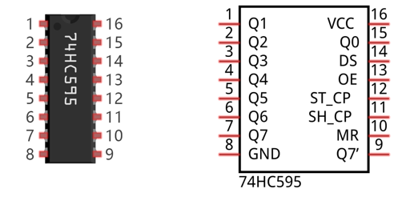
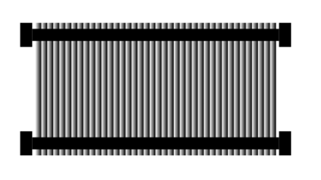
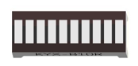
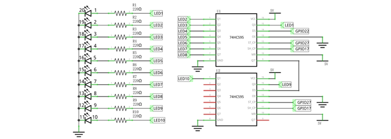

##############################################################################
Chapter 74HC595 & Bar Graph LED
##############################################################################

We have used LED Bar Graph to make a flowing water light, in which 10 GPIO ports of RPi are occupied. More GPIO ports mean that more peripherals can be connected to RPi, so GPIO resource is very precious. Can we make flowing water light with less GPIO ports? In this chapter, we will learn a component, 74HC595, which can achieve the target.

Project 16.1 Flowing Water Light
****************************************************************

Now let us learn how to use the 74HC595 IC Chip to make a flowing water light using less GPIO. 

Component knowledge
================================================================

Bar Graph LED
----------------------------------------------------------------

A Bar Graph LED has 10 LEDs integrated into one compact component. The two rows of pins at its bottom are paired to identify each LED like the single LED used earlier. 

.. image:: ../_static/imgs/16_74HC595_&_Bar_Graph_LED/Chapter16_00.png
    :align: center

74HC595
----------------------------------------------------------------

A 74HC595 chip is used to convert serial data into parallel data. A 74HC595 chip can convert the serial data of one byte into 8 bits, and send its corresponding level to each of the 8 ports correspondingly. With this characteristic, the 74HC595 chip can be used to expand the IO ports of a Raspberry Pi. At least 3 ports on the RPI board are required to control the 8 ports of the 74HC595 chip.

The ports of the 74HC595 chip are described as follows:

.. list-table:: 
    :widths: 1 1 1
    :align: center
    :class: product-table

    *   -   Pin name
        -   Pin number
        -   Description
    
    *   -   Q0-Q7
        -   15, 1-7
        -   Parallel Data Output

    *   -   VCC
        -   16
        -   The Positive Electrode of the Power Supply, the Voltage is 2~6V

    *   -   GND 
        -   8
        -   The Negative Electrode of Power Supply

    *   -   DS
        -   14
        -   Serial Data Input

    *   -   OE
        -   13
        -   Enable Output,

            When this pin is in high level, Q0-Q7 is in high resistance state

            When this pin is in low level, Q0-Q7 is in output mode

    *   -   ST_CP
        -   12
        -   Parallel Update Output: when its electrical level is rising, it will update the
        
            parallel data output.

    *   -   SH_CP
        -   11
        -   Serial Shift Clock: when its electrical level is rising, serial data input 
         
            register will do a shift.

    *   -   MR
        -   10
        -   Remove Shift Register: When this pin is in low level, the content in shift
           
            register will be cleared.

    *   -   Q7'
        -   9
        -   Serial Data Output: it can be connected to more 74HC595 chips in series.

For more details, please refer to the datasheet on the 74HC595 chip.

Component List
================================================================

+---------------------------------------------+
| Freenove Projects Board for Raspberry Pi    |
|                                             |
|  |Chapter01_04|                             |
+---------------------+-----------------------+
| Raspberry Pi        | GPIO Ribbon Cable     |
|                     |                       |
|  |Chapter01_05|     |  |Chapter01_06|       |
+---------------------+-----------------------+
| Bar Graph LED                               |
|                                             |
|  |Chapter16_02|                             |                              
|                                             |
+---------------------------------------------+

.. |Chapter01_04| image:: ../_static/imgs/1_LED/Chapter01_04.png
.. |Chapter01_05| image:: ../_static/imgs/1_LED/Chapter01_05.png

Circuit
================================================================

.. list-table:: 
    :width: 100%
    :align: center
    :class: product-table

    *   -   Schematic diagram
    *   -   |Chapter16_03|
    *   -   Hardware connection:
    *   -   |Chapter16_04|

.. |Chapter16_04| image:: ../_static/imgs/16_74HC595_&_Bar_Graph_LED/Chapter16_04.png

.. hint::

    :red:`If it dosen't work, rotate the LED bar graph for 180°.`

.. note::
    
    :red:`If you have any concerns, please send an email to:` support@freenove.com

Code
================================================================

In this project we will make a flowing water light with a 74HC595 chip to learn about its functions.

C Code 16.1 LightWater02
----------------------------------------------------------------

First, observe the project result, and then learn about the code in detail.

If you have any concerns, please send an email to: support@freenove.com

1.	Use cd command to enter 16_FlowingLight02 directory of C code.

.. code-block:: console

    $ cd ~/Freenove_Kit/Code/C_Code/16_FlowingLight02

2.	Use following command to compile “FlowingLight02.c” and generate executable file “FlowingLight02”.

.. code-block:: console

    $ gcc FlowingLight02.c -o FlowingLight02 -lwiringPi

3.	Then run the generated file “FlowingLight02”.

.. code-block:: console

    $ ./FlowingLight02

After the program runs, you will see that Bar Graph LED starts with the flowing water pattern flashing from right to left and then back from left to right.

The following is the program code:

.. literalinclude:: ../../../freenove_Kit/Code/C_Code/16_FlowingLight02/FlowingLight02.cpp
    :linenos: 
    :language: c

In the code, we configure three pins to control the 74HC595 chip and define a one-byte variable to control the state of the 10 LEDs (in the Bar Graph LED Module) through the 10 bits of the variable. The LEDs light ON when the corresponding bit is 1. If the variable is assigned to 0x01, that is 00000001 in binary, there will be only one LED ON. 

.. code-block:: c

    x=0x0001;

In the “while” loop of main function, use two loops to send x to 74HC595 output pin to control the LED. In one cycle, x will shift one bit to the LEFT in one cycle, then when data of x is sent to 74HC595, the LED that is turned ON will move one bit to the LEFT once.

.. literalinclude:: ../../../freenove_Kit/Code/C_Code/16_FlowingLight02/FlowingLight02.cpp
    :linenos: 
    :language: c
    :lines: 46-52

In second cycle, the situation is the same. The difference is that x is shift from 0x80 to the RIGHT in order.

.. c:function:: << operator

    "<<" is the left shift operator, which can make all bits of 1 byte shift by several bits to the left (high) direction and add 0 on the right (low). For example, shift binary 00000001 by 1 bit to left:
        
        byte x = 1 << 1;

    .. image:: ../_static/imgs/16_74HC595_&_Bar_Graph_LED/Chapter16_05.png
        :align: center
    
    The result of x is 2(binary 00000010).

    .. image:: ../_static/imgs/16_74HC595_&_Bar_Graph_LED/Chapter16_06.png
        :align: center
    
    There is another similar operator" >>". For example, shift binary 00000001 by 1 bit to right:
        byte x = 1 >> 1;
    
    .. image:: ../_static/imgs/16_74HC595_&_Bar_Graph_LED/Chapter16_07.png
        :align: center    

    The result of x is 0(00000000).

    .. image:: ../_static/imgs/16_74HC595_&_Bar_Graph_LED/Chapter16_08.png
        :align: center  
    
    X <<= 1 is equivalent to x = x << 1 and x >>= 1 is equivalent to x = x >> 1

About shift function

.. c:function:: void _shiftOut (uint8_t dPin, uint8_t cPin, uint8_t order, uint8_t val) ;

    This is used to shift a 10-bit data value out with the data being sent out on dPin and the clock being sent out on the cPin. order is as above. Data is clocked out on the rising or falling edge - ie. dPin is set, then cPin is taken high then low - repeated for the 10 bits.

Python Code 16.1 LightWater02 
----------------------------------------------------------------

First, observe the project result, and then learn about the code in detail.

If you have any concerns, please send an email to: support@freenove.com

1.	Use cd command to enter 16_FlowingLight02 directory of Python code.

.. code-block:: console

    $ cd ~/Freenove_Kit/Code/Python_GPIOZero_Code/16_FlowingLight02

2.	Use python command to execute Python code “FlowingLight02.py”. 

.. code-block:: console

    $ python FlowingLight02.py

After the program runs, you will see that Bar Graph LED starts with the flowing water pattern flashing from right to left and then back from left to right.

The following is the program code:

.. literalinclude:: ../../../freenove_Kit/Code/Python_GPIOZero_Code/16_FlowingLight02/LightWater02.py
    :linenos: 
    :language: python

In the code, we define a shiftOut() function, which is used to output values with bits in order, where the dPin for the data pin, cPin for the clock and order for the priority bit flag (high or low). This function conforms to the operational modes of the 74HC595. LSBFIRST and MSBFIRST are two different flow directions.

.. literalinclude:: ../../../freenove_Kit/Code/Python_GPIOZero_Code/16_FlowingLight02/LightWater02.py
    :linenos: 
    :language: python
    :lines: 19-26

In the loop() function, we use two loops to achieve the action goal. First, define a variable x=0x0001. When it is transferred to the output port of 74HC595, the low bit outputs high level, then an LED turns ON. Next, x is shifted one bit, when x is transferred to the output port of 74HC595 once again, the LED that turns ON will be shifted. Repeat the operation, over and over and the effect of a flowing water light will be visible. If the direction of the shift operation for x is different, the flowing direction is different.

.. literalinclude:: ../../../freenove_Kit/Code/Python_GPIOZero_Code/16_FlowingLight02/LightWater02.py
    :linenos: 
    :language: python
    :lines: 34-49
