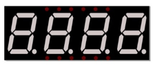
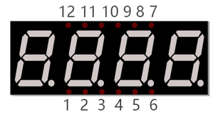

##############################################################################
Chapter 74HC595 & 4-Digit 7-Segment Display
##############################################################################

In this chapter, we will introduce the 7-Segment Display.

Project 17.1 4-Digit 7-Segment Display
****************************************************************

We will use a 74HC595 IC Chip to control a 4-Digit 7-Segment Display and make it display sixteen decimal characters "0” to “F".

Component List
================================================================

+---------------------------------------------+
| Freenove Projects Board for Raspberry Pi    |
|                                             |
|  |Chapter01_04|                             |
+---------------------+-----------------------+
| Raspberry Pi        | GPIO Ribbon Cable     |
|                     |                       |
|  |Chapter01_05|     |  |Chapter01_06|       |
+---------------------+-----------------------+
| 4-Digit 7-Segment Display                   |
|                                             |
|  |Chapter17_00|                             |                              
+---------------------------------------------+

.. |Chapter01_04| image:: ../_static/imgs/1_LED/Chapter01_04.png
.. |Chapter01_05| image:: ../_static/imgs/1_LED/Chapter01_05.png
.. |Chapter01_06| image:: ../_static/imgs/1_LED/Chapter01_06.png

Component knowledge
================================================================

4 Digit 7-Segment Display
----------------------------------------------------------------

A 4 Digit 7-segment display integrates four 7-Segment Displays into one module, therefore it can display more characters. All of the LEDs contained have a Common Anode and individual Cathodes. Its internal structure and pin designation diagram is shown below:

The internal electronic circuit is shown below, and all 8 LED cathode pins of each 7-Segment Display are connected together.

Display method of 4 Digit 7-segment display is similar to 1 Digit 7-segment display. The difference between them is that the 4-Digit displays each Digit is visible in turn, one by one and not together. We need to first send high level to the common end of the first Digit Display, and send low level to the remaining three common ends, and then send content to 8 LED cathode pins of the first Digit Display. At this time, the first 7-Segment Display will show visible content and the remaining three will be OFF.

Similarly, the second, third and fourth 7-Segment Displays will show visible content in turn by scanning the display. Although the four number characters are displayed in turn separately, this process is so fast that it is unperceivable to the naked eye. This is due to the principle of optical afterglow effect and the vision persistence effect in human sight. This is how we can see all 4 number characters at the same time. However, if each number character is displayed for a longer period, you will be able to see that the number characters are displayed separately. 

Code
================================================================

This code uses a 74HC595 IC Chip to control the 4-Digit 7-Segment Display. The use of the 74HC595 IC Chip is generally the same throughout this Tutorial. We need code to display the characters “0” to “F” one character at a time, and then output to display them with the 74HC595 IC Chip.

C Code 17.1 SevenSegmentDisplay
----------------------------------------------------------------

First, observe the project result, and then learn about the code in detail.

.. note::
    
    :red:`If you have any concerns, please send an email to:` support@freenove.com

1.	Use cd command to enter 17_1_SevenSegmentDisplay directory of C code.

.. code-block:: console

    $ cd ~/Freenove_Kit/Code/C_Code/17_1_SevenSegmentDisplay

2.	Use following command to compile “SevenSegmentDisplay.c” and generate executable file “SevenSegmentDisplay”.

.. code-block:: console

    $ gcc SevenSegmentDisplay.c -o SevenSegmentDisplay -lwiringPi

3.	Then run the generated file “SevenSegmentDisplay”.

.. code-block:: console

    $ ./SevenSegmentDisplay

After the program runs, the 4-Digit 7-Segment Display starts to display the characters “0” to “F” in succession.

The following is the program code:

.. literalinclude:: ../../../freenove_Kit/Code/C_Code/17_1_SevenSegmentDisplay/SevenSegmentDisplay.c
    :linenos: 
    :language: c

First, we need to create encoding for characters “0” to “F” in the array.

.. literalinclude:: ../../../freenove_Kit/Code/C_Code/17_1_SevenSegmentDisplay/SevenSegmentDisplay.c
    :linenos: 
    :language: c
    :lines: 15-15

In the "for" loop of loop() function, use the 74HC595 IC Chip to output contents of array “num” successively. SevenSegmentDisplay can then correctly display the corresponding characters. 

.. literalinclude:: ../../../freenove_Kit/Code/C_Code/17_1_SevenSegmentDisplay/SevenSegmentDisplay.c
    :linenos: 
    :language: c
    :lines: 45-52

Python Code 17.1 SevenSegmentDisplay
----------------------------------------------------------------

First, observe the project result, and then learn about the code in detail.

.. note::
    
    :red:`If you have any concerns, please send an email to:` support@freenove.com

1.	Use cd command to enter 17_1_SevenSegmentDisplay directory of Python code.

.. code-block:: console

    $ cd ~/Freenove_Kit/Code/Python_GPIOZero_Code/17_1_SevenSegmentDisplay

2.	Use Python command to execute Python code “SevenSegmentDisplay.py”.

.. code-block:: console

    $ python SevenSegmentDisplay.py

After the program runs, the 4-Digit 7-Segment Display starts to display the characters “0” to “F” in succession.

The following is the program code:

.. literalinclude:: ../../../freenove_Kit/Code/C_Code/17_1_SevenSegmentDisplay/SevenSegmentDisplay.c
    :linenos: 
    :language: c
    :lines: 34-45

Project 17.2 4-Digit 7-Segment Display
****************************************************************

Component List
================================================================

+---------------------------------------------+
| Freenove Projects Board for Raspberry Pi    |
|                                             |
|  |Chapter01_04|                             |
+---------------------+-----------------------+
| Raspberry Pi        | GPIO Ribbon Cable     |
|                     |                       |
|  |Chapter01_05|     |  |Chapter01_06|       |
+---------------------+-----------------------+
| 4-Digit 7-Segment Display                   |
|                                             |
|  |Chapter17_00|                             |                              
+---------------------------------------------+

Circuit
================================================================

The same as that of 17.1 

.. note::
    
    :red:`If you have any concerns, please send an email to:` support@freenove.com

Code
================================================================

In this code, we use the 74HC595 IC Chip to control the 4-Digit 7-Segment Display, and use the dynamic scanning method to show the changing number characters.

C Code 17.2 StopWatch
----------------------------------------------------------------

First, observe the project result, and then learn about the code in detail.

If you have any concerns, please send an email to: support@freenove.com

1.	Use cd command to enter 17_2_StopWatch directory of C code.

.. code-block:: console

    $ cd ~/Freenove_Kit/Code/C_Code/17_2_StopWatch

2.	Use following command to compile "StopWatch.c" and generate executable file "StopWatch". 

.. code-block:: console

    $ gcc StopWatch.c -o StopWatch -lwiringPi

3.	Run the generated file "SteppingMotor".

.. code-block:: console

    $ ./StopWatch

After the program runs, the 4-Digit 7-Segment Display starts displaying a four-digit number dynamically, and the numeric value of this number will increase by plus 1 each second thereafter.

The following is the program code:

.. literalinclude:: ../../../freenove_Kit/Code/C_Code/17_2_StopWatch/StopWatch.c
    :linenos: 
    :language: c

First, we define the pin of the 74HC595 IC Chip and the 7-Segment Display Common Anode, use character encoding and a variable "counter" to enable the counter to be visible on the 7-Segment Display.

.. literalinclude:: ../../../freenove_Kit/Code/C_Code/17_2_StopWatch/StopWatch.c
    :linenos: 
    :language: c
    :lines: 12-17

Subfunction selectDigit (int digit) function is used to open one of the 7-Segment Displays while closing the other 7-Segment Displays, where the parameter digit value can be 1,2,4,8. Using "|" can open a number of a 7-Segment Display.

.. literalinclude:: ../../../freenove_Kit/Code/C_Code/17_2_StopWatch/StopWatch.c
    :linenos: 
    :language: c
    :lines: 19-35

Subfunction outData (int8_t data) is used to make the 74HC595 IC Chip output a 16-bit data immediately.

.. literalinclude:: ../../../freenove_Kit/Code/C_Code/17_2_StopWatch/StopWatch.c
    :linenos: 
    :language: c
    :lines: 52-56

Subfunction display (int dec) is used to make a 4-Digit 7-Segment Display a 4-bit integer. First open the common end of first 7-Segment Display Digit and turn OFF the other three Digits, now it can be used as 1-Digit 7-Segment Display. The first Digit is used for displaying single digits of "dec", the second Digit is for tens, the third for hundreds and fourth for thousands respectively. Each digit will be displayed for a period by using delay (). The time in this code is very brief, so you will see digits all together. If the time is set long enough, you will see that every digit is displayed independently.

.. literalinclude:: ../../../freenove_Kit/Code/C_Code/17_2_StopWatch/StopWatch.c
    :linenos: 
    :language: c
    :lines: 57-79

Subfunction timer (int sig) is the timer function, which will set an alarm to signal. This function will be executed once at set time intervals. Accompanied by the execution, “1” will be added as the variable counter and then reset the time of timer to 1s.

.. literalinclude:: ../../../freenove_Kit/Code/C_Code/17_2_StopWatch/StopWatch.c
    :linenos: 
    :language: c
    :lines: 80-86

Finally, in the main function, configure the GPIO, and set the timer function.

.. literalinclude:: ../../../freenove_Kit/Code/C_Code/17_2_StopWatch/StopWatch.c
    :linenos: 
    :language: c
    :lines: 95-100

In the while loop, make the digital display variable counter value “1”. The value will change in function timer (), so the content displayed by the 7-Segment Display will change accordingly.

.. literalinclude:: ../../../freenove_Kit/Code/C_Code/17_2_StopWatch/StopWatch.c
    :linenos: 
    :language: c
    :lines: 101-103

Python Code 17.2 StopWatch
----------------------------------------------------------------

This code uses the four-step four-part mode to drive the Stepper Motor clockwise and reverse direction.

If you have any concerns, please send an email to: support@freenove.com

1.	Use cd command to enter 17_2_StopWatch directory of Python code.

.. code-block:: console

    $ cd ~/Freenove_Kit/Code/Python_GPIOZero_Code/17_2_StopWatch

2.	Use python command to execute code "StopWatch.py".

.. code-block:: console

    $ python StopWatch.py

After the program runs, 4-Digit 7-segment start displaying a four-digit number dynamically, and the will plus 1 in each successive second.

The following is the program code:

.. literalinclude:: ../../../freenove_Kit/Code/Python_GPIOZero_Code/17_2_StopWatch/StopWatch.py
    :linenos: 
    :language: python

First, define the pin of 74HC595 and 7-segment display common end, character encoding and a variable "counter" to be displayed counter.

.. literalinclude:: ../../../freenove_Kit/Code/Python_GPIOZero_Code/17_2_StopWatch/StopWatch.py
    :linenos: 
    :language: python
    :lines: 14-21

In order for the digital tube to display different numbers, it is necessary for the digital tube to open the first digital tube in a very short time, and then display the code value of the digital tube, and then close it after a delay display for a period of time. Then open the second digital tube and repeat the above operation until the loop has displayed four digital tubes. Then repeat the whole process. So the human eye can see that the nixie tube shows different numbers.

.. literalinclude:: ../../../freenove_Kit/Code/Python_GPIOZero_Code/17_2_StopWatch/StopWatch.py
    :linenos: 
    :language: python
    :lines: 40-58

Subfunction timer () is the timer callback function. When the time is up, this function will be executed. Accompanied by the execution, the variable counter will be added 1, and then reset the time of timer to 1s. 1s later, the function will be executed again.

.. literalinclude:: ../../../freenove_Kit/Code/Python_GPIOZero_Code/17_2_StopWatch/StopWatch.py
    :linenos: 
    :language: python
    :lines: 60-66

Subfunction setup(), configure all input output modes for the GPIO pin used. 

Finally, in loop function, make the digital tube display variable counter value in the while loop. The value will change in function timer (), so the content displayed by 7-segment display will change accordingly.

.. literalinclude:: ../../../freenove_Kit/Code/Python_GPIOZero_Code/17_2_StopWatch/StopWatch.py
    :linenos: 
    :language: python
    :lines: 68-75

After the program runs, press "Ctrl+C", then subfunction destroy() will be executed, and GPIO resources and timers will be released in this subfunction.

.. literalinclude:: ../../../freenove_Kit/Code/Python_GPIOZero_Code/17_2_StopWatch/StopWatch.py
    :linenos: 
    :language: python
    :lines: 77-86

