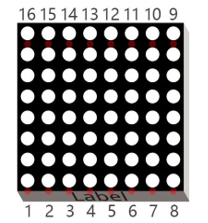
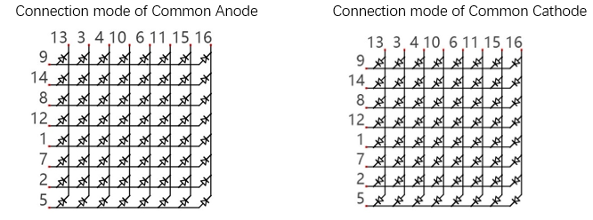
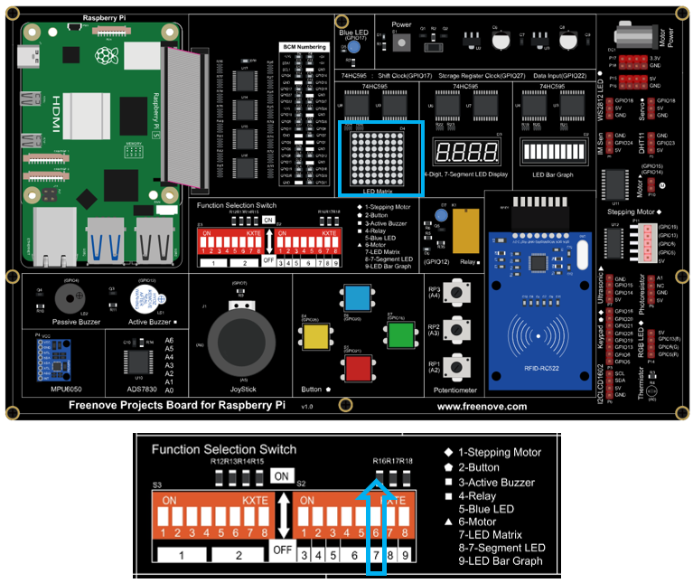

##############################################################################
Chapter 74HC595 & LED Matrix
##############################################################################

Thus far we have learned how to use the 74HC595 IC Chip to control the Bar Graph LED and the 7-Segment Display. We will now use 74HC595 IC Chips to control an LED Matrix.

Project 18.1 LED Matrix
****************************************************************

In this project, we will use two 74HC595 IC chips to control a monochrome (one color) (8X8) LED Matrix to make it display both simple graphics and characters.

Component knowledge
================================================================

LED matrix
----------------------------------------------------------------

An LED Matrix is a rectangular display module that consists of a uniform grid of LEDs. The following is an 8X8 monochrome (one color) LED Matrix containing 64 LEDs (8 rows by 8 columns).

In order to facilitate the operation and reduce the number of ports required to drive this component, the Positive Poles of the LEDs in each row and Negative Poles of the LEDs in each column are respectively connected together inside the LED Matrix module, which is called a Common Anode. There is another arrangement type. Negative Poles of the LEDs in each row and the Positive Poles of the LEDs in each column are respectively connected together, which is called a Common Cathode.

The LED Matrix that we use in this project is a Common Anode LED Matrix.

Here is how a Common Anode LED Matrix works. First, choose 16 ports on RPI board to connect to the 16 ports of LED Matrix. Configure one port in columns for low level, which makes that column the selected port. Then configure the eight port in the row to display content in the selected column. Add a delay value and then select the next column that outputs the corresponding content. This kind of operation by column is called Scan. If you want to display the following image of a smiling face, you can display it in 8 columns, and each column is represented by one byte.

.. image:: ../_static/imgs/18_74HC595_&_LED_Matrix/Chapter18_02.png
    :align: center

.. list-table:: 
    :width: 100%
    :align: center
    :class: product-table

    *   -  Column 
        -  Binary
        -  Hexadecimal

    *   -  1
        -  0001 1100
        -  0x1c

    *   -  2
        -  0010 0010
        -  0x22

    *   -  3
        -  0101 0001
        -  0x51

    *   -  4
        -  0100 0101
        -  0x45

    *   -  5
        -  0100 0101
        -  0x45

    *   -  6
        -  0101 0001
        -  0x51

    *   -  7
        -  0010 0010
        -  0x22

    *   -  8
        -  0001 1100
        -  0x1c

To begin, display the first column, then turn off the first column and display the second column. (and so on) .... turn off the seventh column and display the 8th column, and then start the process over from the first column again like the control of LED Bar Graph project. The whole process will be repeated rapidly in a loop. Due to the principle of optical afterglow effect and the vision persistence effect in human sight, we will see a picture of a smiling face directly rather than individual columns of LEDs turned ON one column at a time (although in fact this is the reality we cannot perceive). 

Scanning rows is another option to display on an LED Matrix (dot matrix grid). Whether scanning by row or column, 16 GPIO is required. In order to save GPIO ports of control board, two 74HC595 IC Chips are used in the circuit. Every 74HC595 IC Chip has eight parallel output ports, so two of these have a combined total of 16 ports, which is just enough for our project. The control lines and data lines of the two 74HC595 IC Chips are not all connected to the RPi, but connect to the Q7 pin of first stage 74HC595 IC Chip and to the data pin of second IC Chip. The two 74HC595 IC Chips are connected in series, which is the same as using one "74HC595 IC Chip" with 16 parallel output ports.

Component List
================================================================

+---------------------------------------------+
| Freenove Projects Board for Raspberry Pi    |
|                                             |
|  |Chapter01_04|                             |
+---------------------+-----------------------+
| Raspberry Pi        | GPIO Ribbon Cable     |
|                     |                       |
|  |Chapter01_05|     |  |Chapter01_06|       |
+---------------------+-----------------------+
| LED matrix                                  |
|                                             |
|  |Chapter18_00|                             |                              
+---------------------------------------------+

.. |Chapter01_04| image:: ../_static/imgs/1_LED/Chapter01_04.png
.. |Chapter01_05| image:: ../_static/imgs/1_LED/Chapter01_05.png
.. |Chapter01_06| image:: ../_static/imgs/1_LED/Chapter01_06.png

Circuit
================================================================

.. list-table:: 
    :width: 100%
    :align: center
    :class: product-table

    *   -   Schematic diagram
    *   -   |Chapter18_03|
    *   -   Hardware connection:
    *   -   |Chapter18_04|

.. |Chapter18_03| image:: ../_static/imgs/18_74HC595_&_LED_Matrix/Chapter18_03.png

.. hint::

    :red:`If it dosen't work, rotate the LED matrix for 180°.`

.. note::
    
    :red:`If you have any concerns, please send an email to:` support@freenove.com

Code
================================================================

Two 74HC595 IC Chips are used in this project, one for controlling the LED Matrix's columns and the other for controlling the rows. According to the circuit connection, row data should be sent first, then column data. The following code will make the LED Matrix display a smiling face, and then display characters "0 to F" scrolling in a loop on the LED Matrix.

C Code 18.1 LEDMatrix
----------------------------------------------------------------

First, observe the project result, and then learn about the code in detail.

.. note::
    
    :red:`If you have any concerns, please send an email to:` support@freenove.com

1.	Use cd command to enter 18_LEDMatrix directory of C language.

.. code-block:: console

    $ cd ~/Freenove_Kit/Code/C_Code/18_LEDMatrix

2.	Use following command to compile “LEDMatrix.c” and generate executable file “LEDMatrix”.

.. code-block:: console

    $ gcc LEDMatrix.c -o LEDMatrix -lwiringPi

3.	Then run the generated file “LEDMatrix”.

.. code-block:: console

    $ ./LEDMatrix

After the program runs, the LED Matrix displays a smiling face, and then displays characters "0 to F" scrolling in a loop on the LED Matrix.

The following is the program code:

.. literalinclude:: ../../../freenove_Kit/Code/C_Code/18_LEDMatrix/LEDMatrix.c
    :linenos: 
    :language: c

The first “for” loop in the “while” loop is used to display a static smile. Displaying column information from left to right, one column at a time with a total of 8 columns. This repeats 500 times to ensure sufficient display time.

.. literalinclude:: ../../../freenove_Kit/Code/C_Code/18_LEDMatrix/LEDMatrix.c
    :linenos: 
    :language: c
    :lines: 65-76

The second “for” loop is used to display scrolling characters "0 to F", for a total of 18 X 8 = 144 columns. Displaying the 0-8 column, then the 1-9 column, then the 2-10 column...... and so on…138-144 column in consecutively to achieve the scrolling effect. The display of each frame is repeated a certain number of times and the more repetitions, the longer the single frame display will be and the slower the scrolling movement.

.. literalinclude:: ../../../freenove_Kit/Code/C_Code/18_LEDMatrix/LEDMatrix.c
    :linenos: 
    :language: c
    :lines: 77-89

Python Code 18.1 LEDMatrix
----------------------------------------------------------------

First, observe the project result, and then learn about the code in detail.

.. note::
    
    :red:`If you have any concerns, please send an email to:` support@freenove.com

1.	Use cd command to enter 18_LEDMatrix directory of Python language.

.. code-block:: console

    $ cd ~/Freenove_Kit/Code/Python_GPIOZero_Code/18_LEDMatrix

2.	Use Python command to execute Python code “LEDMatrix.py”. 

.. code-block:: console

    $ python LEDMatrix.py

After the program runs, the LED Matrix displayss a smiling face, and then displays characters "0 to F" scrolling in a loop on the LED Matrix.

The following is the program code:

.. literalinclude:: ../../../freenove_Kit/Code/Python_GPIOZero_Code/18_LEDMatrix/LEDMatrix.py
    :linenos: 
    :language: python

The first “for” loop in the “while” loop is used to display a static smile. Displaying column information from left to right, one column at a time with a total of 8 columns. This repeats 500 times to ensure sufficient display time.

.. literalinclude:: ../../../freenove_Kit/Code/Python_GPIOZero_Code/18_LEDMatrix/LEDMatrix.py
    :linenos: 
    :language: python
    :lines: 50-58

The second “for” loop is used to display scrolling characters "0 to F", for a total of 18 X 8 = 144 columns. Displaying the 0-8 column, then the 1-9 column, then the 2-10 column...... and so on…138-144 column in consecutively to achieve the scrolling effect. The display of each frame is repeated a certain number of times and the more repetitions, the longer the single frame display will be and the slower the scrolling movement.

.. literalinclude:: ../../../freenove_Kit/Code/Python_GPIOZero_Code/18_LEDMatrix/LEDMatrix.py
    :linenos: 
    :language: python
    :lines: 60-69
