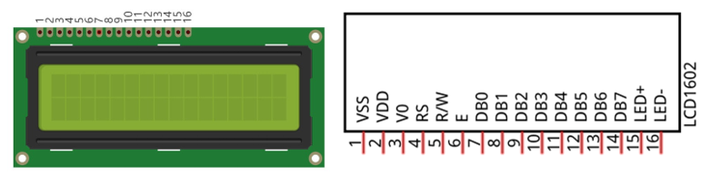
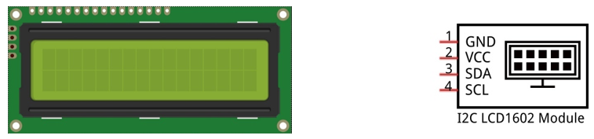
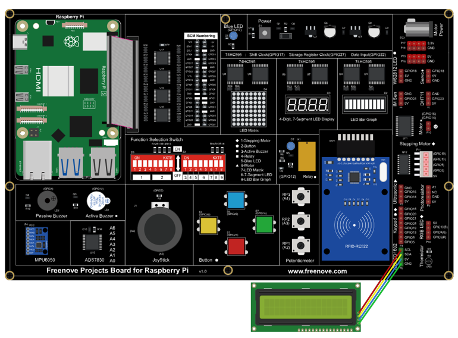

##############################################################################
Chapter LCD1602
##############################################################################

In this chapter, we will learn about the LCD1602 Display Screen,

Project 19.1 I2C LCD1602
****************************************************************

There are LCD1602 display screen and the I2C LCD. We will introduce both of them in this chapter. But what we use in this project is an I2C LCD1602 display screen. The LCD1602 Display Screen can display 2 lines of characters in 16 columns. It is capable of displaying numbers, letters, symbols, ASCII code and so on. As shown below is a monochrome LCD1602 Display Screen along with its circuit pin diagram

I2C LCD1602 Display Screen integrates a I2C interface, which connects the serial-input & parallel-output module to the LCD1602 Display Screen. This allows us to only use 4 lines to operate the LCD1602.

The serial-to-parallel IC chip used in this module is PCF8574T (PCF8574AT), and its default I2C address is 0x27(0x3F). You can also view the RPI bus on your I2C device address through command "i2cdetect -y 1" (refer to the "configuration I2C" section below). 

Below is the PCF8574 chip pin diagram and its module pin diagram:

.. list-table:: 
    :width: 100%
    :align: center
    :class: product-table
    :

    *   -  PCF8574 chip pin diagram:
        -  PCF8574 module pin diagram 

    *   -  |Chapter19_02|
        -  |Chapter19_03|

.. |Chapter19_02| image:: ../_static/imgs/19_LCD1602/Chapter19_02.png
.. |Chapter19_03| image:: ../_static/imgs/19_LCD1602/Chapter19_03.png

PCF8574 module pins and LCD1602 pins correspond to each other and are connected to each other:

.. image:: ../_static/imgs/19_LCD1602/Chapter19_04.png
    :align: center

Because of this, as stated earlier, we only need 4 pins to control the 16 pins of the LCD1602 Display Screen through the I2C interface.

In this project, we will use the I2C LCD1602 to display some static characters and dynamic variables.

Component List
================================================================

+------------------------------------------------+
| Freenove Projects Board for Raspberry Pi       |
|                                                |
|  |Chapter01_04|                                |
+---------------------+--------------------------+
| Raspberry Pi        | GPIO Ribbon Cable        |
|                     |                          |
|  |Chapter01_05|     |  |Chapter01_06|          |
+---------------------+--------------------------+
| Jumper Wire         | I2C LCD1602 Module       |
|                     |                          |
|  |Chapter05_02|     |  |Chapter19_05|          |
+---------------------+--------------------------+

.. |Chapter01_04| image:: ../_static/imgs/1_LED/Chapter01_04.png
.. |Chapter01_05| image:: ../_static/imgs/1_LED/Chapter01_05.png
.. |Chapter01_06| image:: ../_static/imgs/1_LED/Chapter01_06.png
.. |Chapter05_02| image:: ../_static/imgs/5_RGB_LED/Chapter05_02.png
.. |Chapter19_05| image:: ../_static/imgs/19_LCD1602/Chapter19_05.png

Circuit
================================================================

.. note::
    
    the power supply for I2C LCD1602 in this circuit is 5V.

.. list-table:: 
    :width: 100%
    :align: center
    :class: product-table

    *   -   Schematic diagram
    *   -   |Chapter19_06|
    *   -   Hardware connection:
    *   -   |Chapter19_07|

.. note::
    
    :red:`If you have any concerns, please send an email to:` support@freenove.com

Code
================================================================

This code will have your RPi's CPU temperature and System Time Displayed on the LCD1602.

C Code 19.1 I2CLCD1602
----------------------------------------------------------------

If you haven't configured I2C and install Smbus, please refer to Chapter 7. If you've done it, please continue.

First, observe the project result, and then learn about the code in detail.

.. note::
    
    :red:`If you have any concerns, please send an email to:` support@freenove.com

1.	Use cd command to enter 19_I2CLCD1602 directory of C code.

.. code-block:: console

    $ cd ~/Freenove_Kit/Code/C_Code/19_I2CLCD1602

2.	Use following command to compile “I2CLCD1602.c” and generate executable file “I2CLCD1602”.

.. code-block:: console

    $ gcc I2CLCD1602.c -o I2CLCD1602 -lwiringPi -lwiringPiDev

3.	Then run the generated file “I2CLCD1602”.

.. code-block:: console

    $ ./I2CLCD1602

After the program runs, the LCD1602 Screen will display your RPi's CPU Temperature and System Time. 

.. note::
    
    After the program runs, if you nothing displays or the display is not clear, you can try to rotate the white knob on back of LCD1602 slowly, which adjusts the contrast, until the screen can display the Time and Temperature clearly.

The following is the program code:

.. literalinclude:: ../../../freenove_Kit/Code/C_Code/19_I2CLCD1602/I2CLCD1602.c
    :linenos: 
    :language: c

From the code, we can see that the PCF8591 and the PCF8574 have many similarities in using the I2C interface to expand the GPIO RPI. 

First, define the I2C address of the PCF8574 and the Extension of the GPIO pin, which is connected to the GPIO pin of the LCD1602. LCD1602 has two different i2c addresses. Set 0x27 as default.

.. literalinclude:: ../../../freenove_Kit/Code/C_Code/19_I2CLCD1602/I2CLCD1602.c
    :linenos: 
    :language: c
    :lines: 15-25

Then, in main function, initialize the PCF8574, set all the pins to output mode, and turn ON the LCD1602 backlight (without the backlight the Display is difficult to read). 

.. literalinclude:: ../../../freenove_Kit/Code/C_Code/19_I2CLCD1602/I2CLCD1602.c
    :linenos: 
    :language: c
    :lines: 83-87

Then use lcdInit() to initialize LCD1602 and set the RW pin of LCD1602 to 0 (can be written) according to requirements of this function. The return value of the function called "Handle" is used to handle LCD1602".

.. literalinclude:: ../../../freenove_Kit/Code/C_Code/19_I2CLCD1602/I2CLCD1602.c
    :linenos: 
    :language: c
    :lines: 89-89

Details about lcdInit():

.. c:function:: int lcdInit (int rows, int cols, int bits, int rs, int strb, int d0, int d1, int d2, int d3, int d4, int d5, int d6, int d7) ;

    This is the main initialization function and must be executd first before you use any other LCD functions. Rows and cols are the rows and columns of the Display (e.g. 2, 16 or 4, 20). Bits is the number of how wide the number of bits is on the interface (4 or 8). The rs and strb represent the pin numbers of the Display’s RS pin and Strobe (E) pin. The parameters d0 to d7 are the pin numbers of the 8 data pins connected from the RPi to the display. Only the first 4 are used if you are running the display in 4-bit mode.
    
    The return value is the 'handle' to be used for all subsequent calls to the lcd library when dealing with that LCD, or -1 to indicate a fault (usually incorrect parameter)
    
    For more details about LCD Library, please refer to: https://projects.drogon.net/raspberry-pi/wiringpi/lcd-library/ 

In the next “while”, two subfunctions are called to display the RPi's CPU Temperature and the SystemTime. First look at subfunction printCPUTemperature(). The CPU temperature data is stored in the "/sys/class/thermal/thermal_zone0/temp" file. We need to read the contents of this file, which converts it to temperature value stored in variable CPU_temp and uses lcdPrintf() to display it on LCD.

.. literalinclude:: ../../../freenove_Kit/Code/C_Code/19_I2CLCD1602/I2CLCD1602.c
    :linenos: 
    :language: c
    :lines: 28-40

Details about lcdPosition() and lcdPrintf():

.. c:function:: lcdPosition (int handle, int x, int y);

    Set the position of the cursor for subsequent text entry.

.. c:function:: lcdPutchar (int handle, uint8_t data) lcdPuts (int handle, char *string) lcdPrintf (int handle, char *message, …)

    These output a single ASCII character, a string or a formatted string using the usual print formatting commands to display individual characters (it is how you are able to see characters on your computer monitor).

Next is subfunction printDataTime() used to display System Time. First, it gets the Standard Time and stores it into variable Rawtime, and then converts it to the Local Time and stores it into timeinfo, and finally displays the Time information on the LCD1602 Display.

.. literalinclude:: ../../../freenove_Kit/Code/C_Code/19_I2CLCD1602/I2CLCD1602.c
    :linenos: 
    :language: c
    :lines: 41-49

Python Code 19.1 I2CLCD1602
----------------------------------------------------------------

If you haven't configured I2C and install Smbus, please refer to Chapter 7. If you've done it, please continue.

First, observe the project result, and then learn about the code in detail.

.. note::
    
    :red:`If you have any concerns, please send an email to:` support@freenove.com

1.	Use cd command to enter 19_I2CLCD1602 directory of Python code.

.. code-block:: console

    $ cd ~/Freenove_Kit/Code/Python_GPIOZero_Code/19_I2CLCD1602

2.	Use Python command to execute Python code “I2CLCD1602.py”.

.. code-block:: console

    $ python I2CLCD1602.py

After the program runs, the LCD1602 Screen will display your RPi's CPU Temperature and System Time. 

.. note::
    
    :red:`After the program runs, if nothing displays or the display is not clear, try rotating the white knob on back of LCD1602 slowly, which adjusts the contrast, until the screen can display the Time and Temperature clearly.`

The following is the program code:

.. literalinclude:: ../../../freenove_Kit/Code/Python_GPIOZero_Code/19_I2CLCD1602/I2CLCD1602.py
    :linenos: 
    :language: python

In this section, we introduce the LCD1602 module for displaying LCD1602 and the datatime module for getting the time.

.. literalinclude:: ../../../freenove_Kit/Code/Python_GPIOZero_Code/19_I2CLCD1602/I2CLCD1602.py
    :linenos: 
    :language: python
    :lines: 9-11

In the loop function, lCD1602.init_lcd () will initialize LCD1602 for later use.

get_cpu_temp() is used to obtain the system temperature value, get_time_now() is used to obtain the current time, and then lcd1602.write() function is called to display the system temperature and the current time.

.. literalinclude:: ../../../freenove_Kit/Code/Python_GPIOZero_Code/19_I2CLCD1602/I2CLCD1602.py
    :linenos: 
    :language: python
    :lines: 23-30

CPU temperature is stored in file “/sys/class/thermal/thermal_zone0/temp”. Open the file and read content of the file, and then convert it to Celsius degrees and return. Subfunction used to get CPU temperature is shown below:

.. literalinclude:: ../../../freenove_Kit/Code/Python_GPIOZero_Code/19_I2CLCD1602/I2CLCD1602.py
    :linenos: 
    :language: python
    :lines: 14-18

Subfunction used to get time:

.. literalinclude:: ../../../freenove_Kit/Code/Python_GPIOZero_Code/19_I2CLCD1602/I2CLCD1602.py
    :linenos: 
    :language: python
    :lines: 20-21

.. c:function:: Module LCD1602.CharLCD1602()

    This module provides the basic operation method of LCD1602, including class CharLCD1602. Some member functions are described as follows:
    
    **def init_lcd(self,addr=None, bl=1)**: Initialize the lcd1602 device and turn on the backlight.
    
    **def clear(self)**: clear the screen
    
    **def write(self, x, y, str)**: x represents the column, y represents the row, and str represents the character displayed.
    
    **def display_num(self, x, y, num)**: x represents the column, y represents the row, and num represents the number displayed.
