##############################################################################
Chapter LED
##############################################################################

This chapter is the Start Point in the journey to build and explore RPi electronic projects. We will start with simple “Blink” project.

Project Blink
****************************************************************

In this project, we will use RPi to control blinking a common LED.

GPIO
================================================================

GPIO: General Purpose Input/Output. Here we will introduce the specific function of the pins on the Raspberry Pi and how you can utilize them in all sorts of ways in your projects. Most RPi Module pins can be used as either an input or output, depending on your program and its functions.

When programming GPIO pins, there are 3 different ways to reference them: GPIO Numbering, Physical Numbering and WiringPi GPIO Numbering.

BCM GPIO Numbering
----------------------------------------------------------------

The Raspberry Pi CPU uses Broadcom (BCM) processing chips BCM2835, BCM2836 or BCM2837. GPIO pin numbers are assigned by the processing chip manufacturer and are how the computer recognizes each pin. The pin numbers themselves do not make sense or have meaning as they are only a form of identification. Since their numeric values and physical locations have no specific order, there is no way to remember them, so you will need to have a printed reference or a reference board that fits over the pins.

Each pin's functional assignment is defined in the image below:

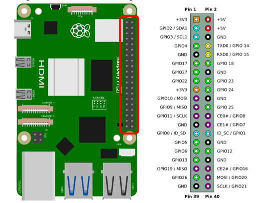

For more details about pin definition of GPIO, please refer to http://pinout.xyz/

PHYSICAL Numbering
----------------------------------------------------------------

Another way to refer to the pins is by simply counting across and down from pin 1 at the top left (nearest to the SD card). This is 'Physical Numbering', as shown below:

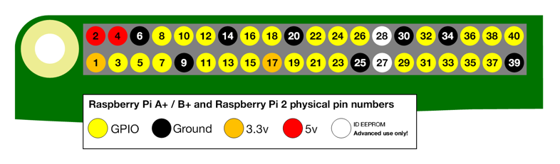

WiringPi GPIO Numbering
----------------------------------------------------------------

Different from the previous two types of GPIO serial numbers, RPi GPIO serial number of the WiringPi are numbered according to the BCM chip used in RPi.

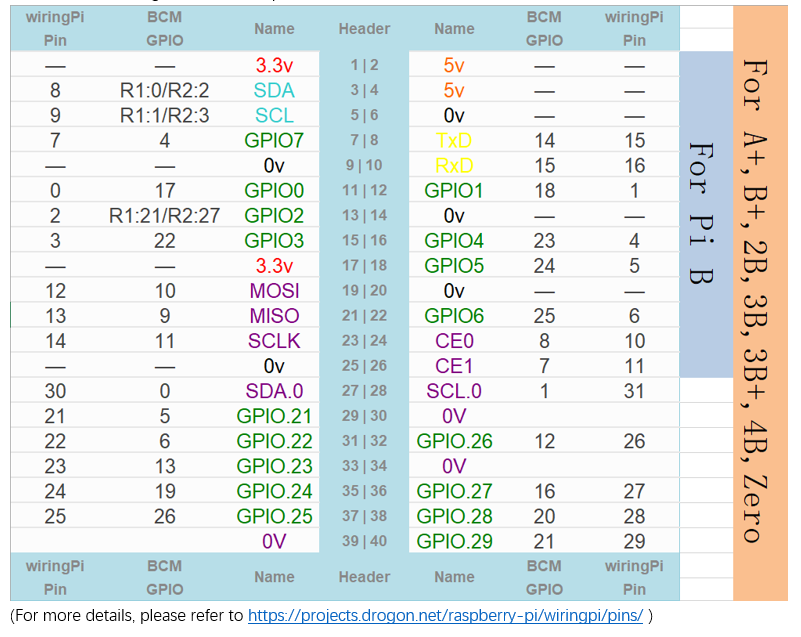

You can also use the following command to view their correlation.

.. code-block:: console
    
    $ gpio readall

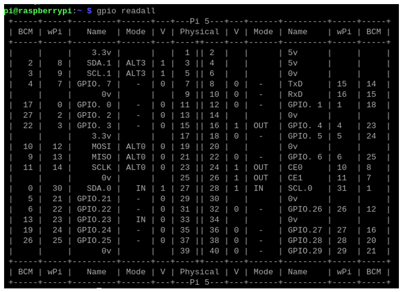

For more details about wiringPi, please refer to https://github.com/WiringPi/WiringPi .

Component List
================================================================

+------------------------------------------+
| Freenove Projects Board for Raspberry Pi |
|                                          |
|  |Chapter01_04|                          |
+---------------------+--------------------+
| Raspberry Pi        | GPIO Ribbon Cable  |
|                     |                    |
|  |Chapter01_05|     |  |Chapter01_06|    |
+---------------------+--------------------+

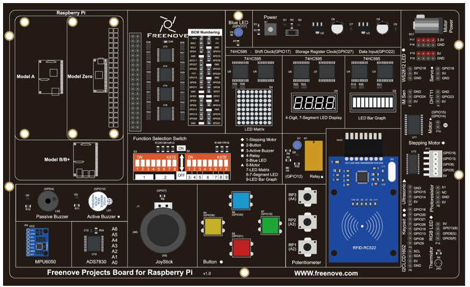
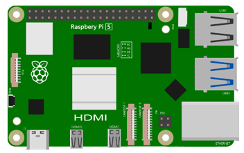
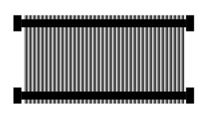

Circuit
================================================================

.. list-table:: 
    :width: 100%
    :align: center
    :class: product-table

    *   -   Schematic diagram
    *   -   |Chapter01_07|
    *   -   Hardware connection:

            Turn ON the power switch and NO.5 toggle switch. 

            Power switch should be turned ON in all the projects.
    *   -   |Chapter01_08|

.. |Chapter01_07| image:: ../_static/imgs/1_LED/Chapter01_07.png
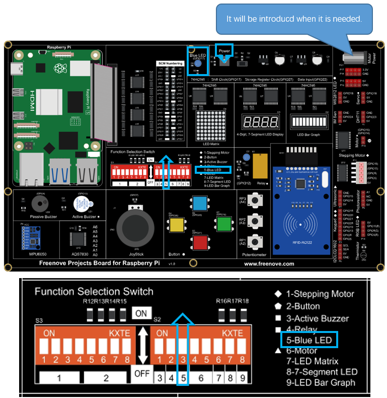

.. note::
    
    :red:`If you have any concerns, please send an email to:` support@freenove.com

Component knowledge
================================================================

LED
----------------------------------------------------------------

An LED is a type of diode. All diodes have two Poles and only work if current is flowing in the correct direction. An LED will only work (light up) if the longer pin (+) of LED is connected to the positive output from a power source and the shorter pin is connected to the negative (-) output, which is also referred to as Ground (GND). This type of component is known as “Polar” (think One-Way Street).

All common 2 lead diodes are the same in this respect. Diodes work only if the voltage of its positive electrode is higher than its negative electrode and there is a narrow range of operating voltage for most all common diodes of 1.9 and 3.4V. If you use much more than 3.3V the LED will be damaged and burnt out.

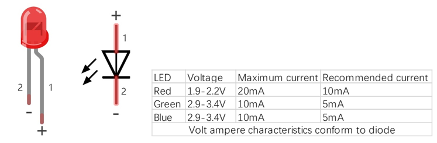

.. note:: 
    
    LEDs cannot be directly connected to a power supply, which usually ends in a damaged component. A resistor with a specified resistance value must be connected in series to the LED you plan to use.

Resistor
----------------------------------------------------------------

Resistors use Ohms (Ω) as the unit of measurement of their resistance (R). 1MΩ=1000kΩ, 1kΩ=1000Ω.

A resistor is a passive electrical component that limits or regulates the flow of current in an electronic circuit.

On the left, we see a physical representation of a resistor, and the right is the symbol used to represent the presence of a resistor in a circuit diagram or schematic.

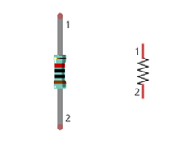

The bands of color on a resistor is a shorthand code used to identify its resistance value. For more details of resistor color codes, please refer to the card in the kit package.

With a fixed voltage, there will be less current output with greater resistance added to the circuit. The relationship between Current, Voltage and Resistance can be expressed by this formula: I=V/R known as Ohm’s Law where I = Current, V = Voltage and R = Resistance. Knowing the values of any two of these allows you to solve the value of the third.

In the following diagram, the current through R1 is: I=U/R=5V/10kΩ=0.0005A=0.5mA.

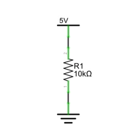

.. warning::
    
    Never connect the two poles of a power supply with anything of low resistance value (i.e. a metal object or bare wire). This is a Short and results in high current that may damage the power supply and electronic components.

.. note::
    
    Unlike LEDs and Diodes, Resistors have no poles and re non-polar (it does not matter which direction you insert them into a circuit, it will work the same)

Code
================================================================

According to the circuit, when the GPIO17 of RPi output level is high, the LED turns ON. Conversely, when the GPIO17 RPi output level is low, the LED turns OFF. Therefore, we can let GPIO17 cycle output high and output low level to make the LED blink. We will use both C code and Python code to achieve the target.

C Code 1.1 Blink
----------------------------------------------------------------

First, enter this command into the Terminal one line at a time. Then observe the results it brings on your project, and learn about the code in detail. 

If you want to execute it with editor, please refer to section Code Editor to configure.

.. note::
    
    :red:`If you have any concerns, please send an email to:` support@freenove.com

It is recommended to execute the code via command line.

1.	If you did not update wiring pi, please execute following commands one by one.
    
.. code-block:: console

    $ sudo apt-get update
    $ git clone https://github.com/WiringPi/WiringPi
    $ cd WiringPi
    $ ./build

2.	Use cd command to enter 1_Blink directory of C code.

.. code-block:: console

    $ cd ~/Freenove_Kit/Code/C_Code/1_Blink

3.	Use the following command to compile the code “Blink.c” and generate executable file “Blink”.

“l” of “lwiringPi” is low case of “L”.

.. code-block:: console

    $ gcc Blink.c -o Blink -lwiringPi

4.	Then run the generated file “blink”.

.. code-block:: console

    $ ./Blink

Now your LED should start blinking! CONGRATUALTIONS! You have successfully completed your first RPi circuit! 

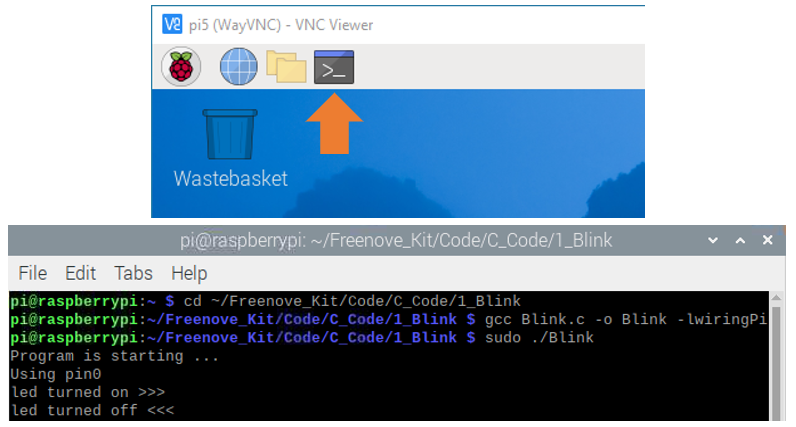

You can also use the file browser. On the left of folder tree, right-click the folder you want to enter, and click "Open in Terminal".

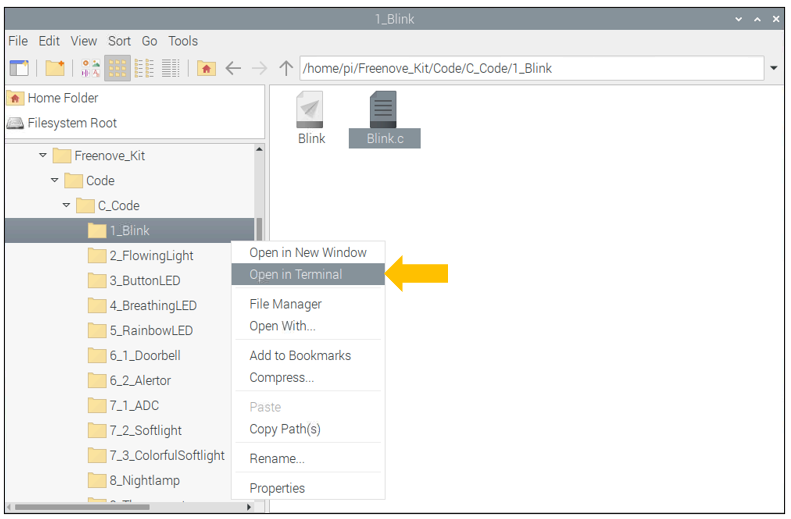

You can press “Ctrl+C” to end the program. The following is the program code:

.. literalinclude:: ../../../freenove_Kit/Code/C_Code/1_Blink/Blink.c
    :linenos: 
    :language: c

In the code above, the configuration function for GPIO is shown below as: 

.. c:function:: void pinMode(int pin, int mode);	

    This sets the mode of a pin to either INPUT, OUTPUT, PWM_OUTPUT or GPIO_CLOCK. Note that only wiringPi pin 1 (BCM_GPIO 18) supports PWM output and only wiringPi pin 7 (BCM_GPIO 4) supports CLOCK output modes.
    
    This function has no effect when in Sys mode. If you need to change the pin mode, then you can do it with the gpio program in a script before you start your program 

.. c:function:: void digitalWrite (int pin, int value);	
    
    Writes the value HIGH or LOW (1 or 0) to the given pin, which must have been previously set as an output.

For more related wiringpi functions, please refer to https://github.com/WiringPi/WiringPi

GPIO connected to ledPin in the circuit is GPIO17. 

So ledPin should be defined as 17 pin. You can refer to the GPIO Numbering Relationship.

.. code-block:: c

    #define  ledPin    17 //define the led pin number

GPIO Numbering Relationship

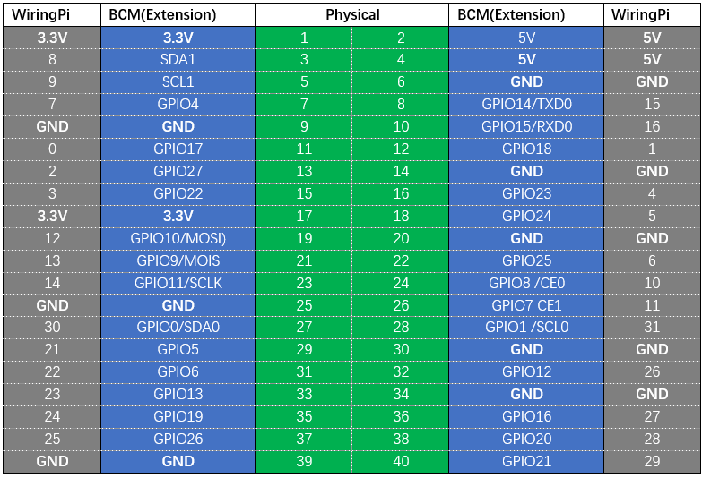

In the main function main(), initialize GPIO first.

.. code-block:: c

    //wiringPiSetup();  //Initialize wiringPi. Use WiringPi Number.
    wiringPiSetupGpio();//Initialize wiringPi. Use BCM Number.

After the wiringPi is initialized successfully, you can set the ledPin to output mode and then enter the while loop, which is an endless loop (a while loop). That is, the program will always be executed in this cycle, unless it is ended because of external factors. In this loop, use digitalWrite (ledPin, HIGH) to make ledPin output high level, then LED turns ON. After a period of time delay, use digitalWrite(ledPin, LOW) to make ledPin output low level, then LED turns OFF, which is followed by a delay. Repeat the loop, then LED will start blinking.

.. literalinclude:: ../../../freenove_Kit/Code/C_Code/1_Blink/Blink.c
    :linenos: 
    :language: c
    :lines: 16-25

Python Code 1.1 Blink
----------------------------------------------------------------

Now, we will use Python language to make a LED blink. 

First, observe the project result, and then learn about the code in detail. 

If you have any concerns, please send an email to: support@freenove.com

1.	Use cd command to enter 1_Blink directory of Python code.

.. code-block:: console

    cd ~/Freenove_Kit/Code/Python_GPIOZero_Code/1_Blink

2.	Use python command to execute python code blink.py.

.. code-block:: console

    python Blink.pypython

The LED starts blinking.

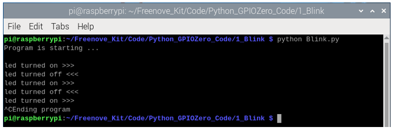

You can press **"Ctrl+C"** to end the program. The following is the program code:

.. literalinclude:: ../../../freenove_Kit/Code/Python_GPIOZero_Code/1_Blink/Blink.py
    :linenos: 
    :language: python

About gpiozero.LED:

.. c:function:: gpiozero.LED

    The gpiozero library is an object-oriented python library where the LED module is used to control leds.

.. c:function:: LED(pin)

    LED module, used to apply for a control LED object, please fill in the gpio pin correctly. Please refer to the following writing method.
    
    led = LED(17)           # BCM
    
    led = LED("GPIO17")     # BCM
    
    led = LED("BCM17")     # BCM
    
    led = LED("BOARD11")   # BOARD
   
    led = LED("WPI0")       # WiringPi
    
    led = LED("J8:11")       # BOARD

.. c:function:: led.on()

    Control GPIO output high level.

.. c:function:: led.off()

    Control GPIO output low level.

.. c:function:: led.close()

    Release the GPIO resource.

For more functions related to GPIOZERO, please refer to:

https://github.com/gpiozero/gpiozero 

"import time" time is a module of python.

https://docs.python.org/2/library/time.html?highlight=time%20time#module-time

The Blue LED is controlled using GPIO17. GPIO17 is based on the BCM Number, so just fill in 17 in the code.

.. code-block:: python

    led = LED(17)           # define LED pin according to BCM Numbering

GPIO Numbering Relationship

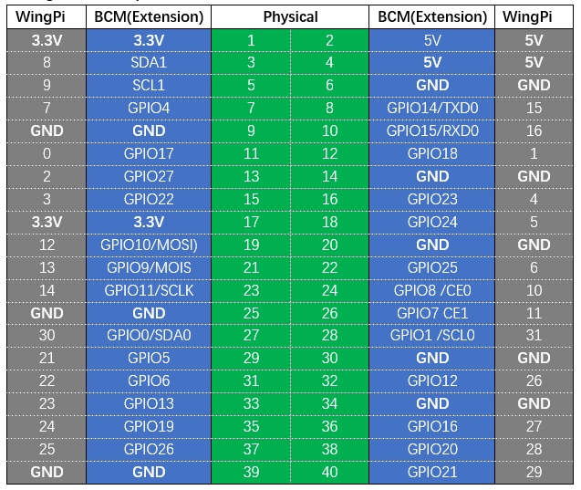

In loop(), there is a while loop, which is an endless loop (a while loop). That is, the program will always be executed in this loop, unless it is ended because of external factors. In this loop, set led pin output high level, then the LED turns ON. After a period of time delay, set led pin output low level, then the LED turns OFF, which is followed by a delay. Repeat the loop, then LED will start blinking. 

.. literalinclude:: ../../../freenove_Kit/Code/Python_GPIOZero_Code/1_Blink/Blink.py
    :linenos: 
    :language: python
    :lines: 22-29

Each time the program terminates, the led module needs to release the GPIO resource. If you do not release the GPIO pin, the GPIO pin cannot be used the next time, and an error message is displayed in Terminal. Like "GPIO Busy."

.. code-block:: python

    led.close()

**Each time you want to exit the program, use Ctrl+C to exit the program. Do not use Ctrl+Z or close Terminal to exit the code directly.**

This may cause the GPIO resource to be occupied, making it impossible to continue calling the GPIO.

If you accidentally use this action. You can use this by enter “fg” in Terminal, then pressing Enter. It will resume suspended tasks that occupy GPIO resources. Then you can use Ctrl+C to exit the code normally.

Of course, you can also choose to restart the RPI directly. It can also be used to free up GPIO resources.
