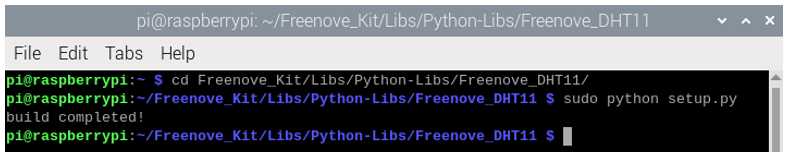

##############################################################################
Chapter Hygrothermograph DHT11
##############################################################################

In this chapter, we will learn about a commonly used sensor called a Hygrothermograph DHT11.

Project 20.1 Hygrothermograph
****************************************************************

Hygrothermograph is an important tool in our lives to give us data on the temperature and humidity in our environment. In this project, we will use the RPi to read Temperature and Humidity data of the DHT11 Module.

Component knowledge
================================================================

The Temperature & Humidity Sensor DHT11 is a compound temperature & humidity sensor, and the output digital signal has been calibrated by its manufacturer.

.. image:: ../_static/imgs/20_Hygrothermograph_DHT11/Chapter20_00.png
    :align: center

After being powered up, it will initialize in 1 second. Its operating voltage is within the range of 3.3V-5.5V.

The SDA pin is a data pin, which is used to communicate with other devices. 

The NC pin (Not Connected Pin) is a type of pin found on various integrated circuit packages. Such pin has no functional purpose to the outside circuit (but may have an unknown functionality during manufacture and test). It should not be connected to any of the circuit connections.

Component List
================================================================

+------------------------------------------------+
| Freenove Projects Board for Raspberry Pi       |
|                                                |
|  |Chapter01_04|                                |
+---------------------+--------------------------+
| Raspberry Pi        | GPIO Ribbon Cable        |
|                     |                          |
|  |Chapter01_05|     |  |Chapter01_06|          |
+---------------------+--------------------------+
| Jumper Wire         | DHT11 Module             |
|                     |                          |
|  |Chapter05_02|     |  |Chapter20_01|          |
+---------------------+--------------------------+

.. |Chapter01_04| image:: ../_static/imgs/1_LED/Chapter01_04.png
.. |Chapter01_05| image:: ../_static/imgs/1_LED/Chapter01_05.png
.. |Chapter01_06| image:: ../_static/imgs/1_LED/Chapter01_06.png
.. |Chapter05_02| image:: ../_static/imgs/5_RGB_LED/Chapter05_02.png

Circuit
================================================================

.. list-table:: 
    :width: 100%
    :align: center
    :class: product-table

    *   -   Schematic diagram
    *   -   |Chapter20_02|
    *   -   Hardware connection:
    *   -   |Chapter20_03|

.. |Chapter20_03| image:: ../_static/imgs/20_Hygrothermograph_DHT11/Chapter20_03.png

.. note::
    
    :red:`If you have any concerns, please send an email to:` support@freenove.com

Code
================================================================

The code is used to read the temperature and humidity data of DHT11, and display them.

C Code 20.1 DHT11
----------------------------------------------------------------

First, observe the project result, and then learn about the code in detail.

.. note::
    
    :red:`If you have any concerns, please send an email to:` support@freenove.com

1.	Use cd command to enter 20_DHT11 directory of C code.

.. code-block:: console

    $ cd ~/Freenove_Kit/Code/C_Code/20_DHT11

2.	The code used in this project contains a custom header file. Use the following command to compile the code DHT11.cpp and DHT.cpp and generate executable file DHT11. The custom header file will be compiled at the same time.

.. code-block:: console

    $ gcc DHT.cpp DHT11.cpp -o DHT11 -lwiringPi

3.	Run the generated file "DHT11".

.. code-block:: console

    $ ./DHT11

After the program runs, the Terminal window will display the current total number of read times, the read state, as well as temperature and humidity values as is shown below:

The following is the program code:

.. literalinclude:: ../../../freenove_Kit/Code/C_Code/20_DHT11/DHT11.cpp
    :linenos: 
    :language: c

In this project code, we use a custom library file "DHT.hpp". It is located in the same directory with the program files "DHT11.cpp" and "DHT.cpp", and methods for reading DHT sensor are provided in the library file. By using this library, we can easily read the DHT Sensor. First, we create a DHT class object in the code.

.. code-block:: c

    DHT dht;

In the "while" loop, the value of DHT11 is read every 3 seconds through the dht.readdht11 () function.

.. literalinclude:: ../../../freenove_Kit/Code/C_Code/20_DHT11/DHT11.cpp
    :linenos: 
    :language: c
    :lines: 22-42

Finally display the results:

.. code-block:: c

    printf("Humidity is %.2f %%, \t Temperature is %.2f *C\n\n",dht.humidity,dht.temperature);

Library file "DHT.hpp" contains a DHT class and this public member function int readDHT11 (int pin) is used to read sensor DHT11 and store the temperature and humidity data read to member variables double humidity and temperature. The implementation method of the function is included in the file "DHT.cpp".

.. literalinclude:: ../../../freenove_Kit/Code/C_Code/20_DHT11/DHT.hpp
    :linenos: 
    :language: c

Python Code 20.1 DHT11
----------------------------------------------------------------

First, observe the project result, and then learn about the code in detail.

.. note::
    
    :red:`If you have any concerns, please send an email to:` support@freenove.com

1.	Use cd command to enter folder of the ADC Device library.

.. code-block:: console

    $ cd ~/Freenove_Kit/Libs/Python-Libs/Freenove_DHT11

2.	Execute command below to install the library.

.. code-block:: console

    $ sudo python setup.py

A successful installation, without error prompts, is shown below:

Next, we will execute the code for this project. 

1.	Use cd command to enter 20_DHT11 directory of Python code.

.. code-block:: console

    $ cd ~/Freenove_Kit/Code/Python_GPIOZero_Code/20_DHT11

2.	Use Python command to execute code "DHT11.py".

.. code-block:: console

    $ python DHT11.py

After the program runs, the Terminal window will display the current total number of read times, the read state, as well as temperature and humidity values as is shown below:

The following is the program code:

.. literalinclude:: ../../../freenove_Kit/Code/Python_GPIOZero_Code/20_DHT11/DHT11.py
    :linenos: 
    :language: python

In this project code, we use a module "Freenove_DHT.py", which provides the method of reading the DHT Sensor. It is located in the same directory with program files "DHT11.py". By using this library, we can easily read the DHT Sensor. First, we create a DHT class object in the code.

.. code-block:: c

    dht = DHT.DHT(DHTPin)   #create a DHT class object

Then in the "while" loop, use chk = dht.readDHT11 (DHT11Pin) to read the DHT11, and determine whether the data read is normal according to the return value "chk".

.. literalinclude:: ../../../freenove_Kit/Code/Python_GPIOZero_Code/20_DHT11/DHT11.py
    :linenos: 
    :language: python
    :lines: 17-28

Module "Freenove_DHT.py" contains a DHT class. The class function of the def readDHT11 (pin) is used to read the DHT11 Sensor and store the temperature and humidity data read to member variables humidity and temperature. 

.. py:function:: Freenove_DHT Module

    This is a Python module for reading the temperature and humidity data of the DHT Sensor. Partial functions and variables are described as follows:
    **getHumidity()**: store humidity data read from sensor
    **getTemperature()**: store temperature data read from sensor
    **readDHT11()**: read the temperature and humidity of sensor DHT11, and return values used to determine whether the data is normal.

