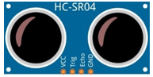
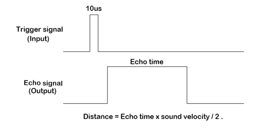

##############################################################################
Chapter Ultrasonic Ranging
##############################################################################

In this chapter, we learn a module which use ultrasonic to measure distance, HC SR04.

Project 23.1 Ultrasonic Ranging
****************************************************************

In this project, we use ultrasonic ranging module to measure distance, and print out the data in the terminal.

Component Knowledge
================================================================

The Ultrasonic Ranging Module uses the principle that ultrasonic waves will be reflected when they encounter any obstacles. This is possible by counting the time interval between when the ultrasonic wave is transmitted to when the ultrasonic wave reflects back after encountering an obstacle. Time interval counting will end after an ultrasonic wave is received, and the time difference (delta) is the total time of the ultrasonic wave’s journey from being transmitted to being received. Because the speed of sound in air is a constant, and is about v=340m/s, we can calculate the distance between the Ultrasonic Ranging Module and the obstacle: s=vt/2.

.. image:: ../_static/imgs/23_Ultrasonic_Ranging/Chapter23_00.png
    :align: center

The HC-SR04 Ultrasonic Ranging Module integrates both an ultrasonic transmitter and a receiver. The transmitter is used to convert electrical signals (electrical energy) into high frequency (beyond human hearing) sound waves (mechanical energy) and the function of the receiver is opposite of this. The picture and the diagram of the HC SR04 Ultrasonic Ranging Module are shown below:

.. list-table:: 
    :width: 70%
    :align: center
    :class: product-table
    
    *   -   |Chapter23_01|
        -   |Chapter23_02|

.. |Chapter23_02| image:: ../_static/imgs/23_Ultrasonic_Ranging/Chapter23_02.png

Pin description:

.. list-table:: 
    :width: 70%
    :align: center
    :class: product-table
    
    *   -   VCC
        -   power supply pin

    *   -   Trig
        -   trigger pin

    *   -   Echo
        -   Echo pin

    *   -   GND
        -   GND

**Technical specs:**

Working voltage: 5V

Working current: 12mA

Minimum measured distance: 2cm

Maximum measured distance: 200cm

Instructions for Use: output a high-level pulse in Trig pin lasting for least 10uS, the module begins to transmit ultrasonic waves. At the same time, the Echo pin is pulled up. When the module receives the returned ultrasonic waves from encountering an obstacle, the Echo pin will be pulled down. The duration of high level in the Echo pin is the total time of the ultrasonic wave from transmitting to receiving, s=vt/2. This is done constantly.

Component List
================================================================

+------------------------------------------------+
| Freenove Projects Board for Raspberry Pi       |
|                                                |
|  |Chapter01_04|                                |
+---------------------+--------------------------+
| Raspberry Pi        | GPIO Ribbon Cable        |
|                     |                          |
|  |Chapter01_05|     |  |Chapter01_06|          |
+---------------------+--------------------------+
| Jumper Wire         | HC SR501                 |
|                     |                          |
|  |Chapter05_02|     |  |Chapter23_01|          |
+---------------------+--------------------------+

.. |Chapter01_04| image:: ../_static/imgs/1_LED/Chapter01_04.png
.. |Chapter01_05| image:: ../_static/imgs/1_LED/Chapter01_05.png
.. |Chapter01_06| image:: ../_static/imgs/1_LED/Chapter01_06.png
.. |Chapter05_02| image:: ../_static/imgs/5_RGB_LED/Chapter05_02.png

Circuit
================================================================

.. list-table:: 
    :width: 100%
    :align: center
    :class: product-table

    *   -   Schematic diagram
    *   -   |Chapter23_04|
    *   -   Hardware connection:
    *   -   After running the program, hold an object in front of the sensor and change their distance.
            
            |Chapter23_05|

.. |Chapter23_04| image:: ../_static/imgs/23_Ultrasonic_Ranging/Chapter23_04.png
.. |Chapter23_05| image:: ../_static/imgs/23_Ultrasonic_Ranging/Chapter23_05.png

.. note::
    
    :red:`If you have any concerns, please send an email to:` support@freenove.com

Code
================================================================

C Code 23.1 UltrasonicRanging
----------------------------------------------------------------

First, observe the project result, and then learn about the code in detail.

.. note::
    
    :red:`If you have any concerns, please send an email to:` support@freenove.com

1.	Use cd command to enter 23_UltrasonicRanging directory of C code.

.. code-block:: console

    $ cd ~/Freenove_Kit/Code/C_Code/23_UltrasonicRanging

2.	Use following command to compile "UltrasonicRanging.c" and generate executable file "UltrasonicRanging". 

.. code-block:: console

    $ gcc UltrasonicRanging.c -o UltrasonicRanging -lwiringPi

3.	Then run the generated file "UltrasonicRanging".

.. code-block:: console

    $ ./UltrasonicRanging

After the program runs, aim the Ultrasonic Ranging Module's detectors ("eyes") perpendicular to the surface of an object (try using your hand). The distance between the ultrasonic module and the object will be displayed in the terminal. As is shown below:

.. literalinclude:: ../../../freenove_Kit/Code/C_Code/23_UltrasonicRanging/UltrasonicRanging.c
    :linenos: 
    :language: c

First, define the pins and the maximum measurement distance.

.. literalinclude:: ../../../freenove_Kit/Code/C_Code/23_UltrasonicRanging/UltrasonicRanging.c
    :linenos: 
    :language: c
    :lines: 11-13

If the module does not return high level, we cannot wait for this forever, so we need to calculate the time period for the maximum distance, that is, time Out. timeOut= 2*MAX_DISTANCE/100/340*1000000. The result of the constant part in this formula is approximately 58.8. 

.. literalinclude:: ../../../freenove_Kit/Code/C_Code/23_UltrasonicRanging/UltrasonicRanging.c
    :linenos: 
    :language: c
    :lines: 14-14

Lastly, in the while loop of main function, get the measurement distance and display it continually.

.. literalinclude:: ../../../freenove_Kit/Code/C_Code/23_UltrasonicRanging/UltrasonicRanging.c
    :linenos: 
    :language: c
    :lines: 36-40

About function pulseIn():

.. c:function:: int pulseIn(int pin, int level, int timeout);

    Return the length of the pulse (in microseconds) or 0 if no pulse is completed before the timeout (unsigned long).

Python Code 23.1 UltrasonicRanging
----------------------------------------------------------------

First, observe the project result, and then learn about the code in detail.

If you have any concerns, please send an email to: support@freenove.com

1.	Use cd command to enter 23_UltrasonicRanging directory of Python code.

.. code-block:: console

    $ cd ~/Freenove_Kit/Code/Python_GPIOZero_Code/23_UltrasonicRanging

2.	Use Python command to execute code "UltrasonicRanging.py".

.. code-block:: console

    $ python UltrasonicRanging.py

After the program runs, aim the Ultrasonic Ranging Module's detectors ("eyes") perpendicular to the surface of an object (try using your hand). The distance between the ultrasonic module and the object will be displayed in the terminal. As is shown below:

The following is the program code:

.. literalinclude:: ../../../freenove_Kit/Code/Python_GPIOZero_Code/23_UltrasonicRanging/UltrasonicRanging.py
    :linenos: 
    :language: python

Importing libraries and modules, gpiozero library integrates a module for ultrasonic sensors DistanceSensor, we can use it to obtain ultrasonic sensor data. Use the warning module to mask some unimportant warnings.

.. literalinclude:: ../../../freenove_Kit/Code/Python_GPIOZero_Code/23_UltrasonicRanging/UltrasonicRanging.py
    :linenos: 
    :language: python
    :lines: 8-11

Set the pin of the ultrasonic data and initialize it. Note that max_distance is measured in meters.

.. literalinclude:: ../../../freenove_Kit/Code/Python_GPIOZero_Code/23_UltrasonicRanging/UltrasonicRanging.py
    :linenos: 
    :language: python
    :lines: 13-15

The ultrasonic sensor data is obtained using Sensor.distance and converted to a value in centimeters.

.. literalinclude:: ../../../freenove_Kit/Code/Python_GPIOZero_Code/23_UltrasonicRanging/UltrasonicRanging.py
    :linenos: 
    :language: python
    :lines: 17-20

Release the GPIO resource.

.. literalinclude:: ../../../freenove_Kit/Code/Python_GPIOZero_Code/23_UltrasonicRanging/UltrasonicRanging.py
    :linenos: 
    :language: python
    :lines: 29-29

