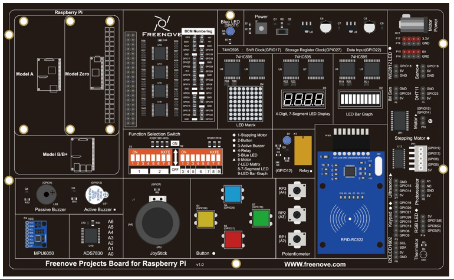

##############################################################################
Chapter Attitude Sensor MPU6050
##############################################################################

In this chapter, we will learn about a MPU6050 Attitude sensor, which integrates an Accelerometer and Gyroscope.

Project 24.1 Read an MPU6050 Sensor Module
****************************************************************

In this project, we will read Acceleration and Gyroscope Data of the MPU6050 Sensor.

Component knowledge
================================================================

MPU6050
----------------------------------------------------------------

MPU6050 Sensor Module is a complete 6-axis Motion Tracking Device. It combines a 3-axis Gyroscope, a 3-axis Accelerometer and a DMP (Digital Motion Processor) all in a small package. The settings of the Accelerometer and Gyroscope of MPU6050 can be changed. A precision wide range digital temperature sensor is also integrated to compensate data readings for changes in temperature, and temperature values can also be read. The MPU6050 Module follows the I2C communication protocol and the default address is 0x68.

The port description of the MPU6050 Module is as follows:

.. list-table:: 
    :width: 100%
    :align: center
    :class: product-table
    
    
    *   -   Pin name
        -   Pin number
        -   Description

    *   -   VCC
        -   1
        -   Positive pole of power supply with voltage 5V

    *   -   GND
        -   2
        -   Negative pole of power supply 

    *   -   SCL
        -   3
        -   I2C communication clock pin

    *   -   SDA
        -   4
        -   I2C communication data pin

    *   -   XDA
        -   5
        -   I2C host data pin which can be connected to other devices.

    *   -   XCL
        -   6
        -   I2C host clock pin which can be connected to other devices.

    *   -   AD0
        -   7
        -   I2C address bit control pin.

            Low level: the device address is 0x68
            
            High level: the device address is 0x69

    *   -   INT
        -   8
        -   Output interrupt pin

For more detail, please refer to the MPU6050 datasheet.

Component List
================================================================

+------------------------------------------+
| Freenove Projects Board for Raspberry Pi |
|                                          |
|  |Chapter01_04|                          |
+---------------------+--------------------+
| Raspberry Pi        | GPIO Ribbon Cable  |
|                     |                    |
|  |Chapter01_05|     |  |Chapter01_06|    |
+---------------------+--------------------+

.. |Chapter01_05| image:: ../_static/imgs/1_LED/Chapter01_05.png
.. |Chapter01_06| image:: ../_static/imgs/1_LED/Chapter01_06.png

Circuit
================================================================

.. list-table:: 
    :width: 100%
    :align: center
    :class: product-table

    *   -   Schematic diagram
    *   -   |Chapter24_01|
    *   -   Hardware connection:
    *   -   After running the program, hold an object in front of the sensor and change their distance.
            
            |Chapter24_02|

.. note::
    
    :red:`If you have any concerns, please send an email to:` support@freenove.com

Code
================================================================

In this project, we will read the acceleration data and gyroscope data of MPU6050, and print them out.

C Code 24.1 MPU6050RAW
----------------------------------------------------------------

First, observe the project result, and then learn about the code in detail.

If you have any concerns, please send an email to: support@freenove.com

1.	Use cd command to enter 24_MPU6050 directory of C code.

.. code-block:: console

    $ cd ~/Freenove_Kit/Code/C_Code/24_MPU6050

2.	Use following command to compile "MPU6050RAW.c", "MPU6050.cpp" and "I2Cdev.cpp", and generate executable file "MPU6050RAW".

.. code-block:: console

    $ gcc MPU6050RAW.cpp MPU6050.cpp I2Cdev.cpp -o MPU6050RAW

3.	Then run the generated file "MPU6050RAW".

.. code-block:: console

    $ ./MPU6050RAW

After the program runs, the Terminal will display active accelerometer and gyroscope data of the MPU6050, as well as the conversion to gravity acceleration and angular velocity as units of data. As shown in the following figure:

The following is the program code:

.. literalinclude:: ../../../freenove_Kit/Code/C_Code/24_MPU6050/MPU6050RAW.cpp
    :linenos: 
    :language: c

Two library files "MPU6050.h" and "I2Cdev.h" are used in the code and will be compiled with others. Class MPU6050 is used to operate the MPU6050 Sensor. When used, first it initiates an object.

.. literalinclude:: ../../../freenove_Kit/Code/C_Code/24_MPU6050/MPU6050RAW.cpp
    :linenos: 
    :language: c
    :lines: 13-13

In the setup function, the MPU6050 is initialized and the result of the initialization will be tested.

.. literalinclude:: ../../../freenove_Kit/Code/C_Code/24_MPU6050/MPU6050RAW.cpp
    :linenos: 
    :language: c
    :lines: 18-26

In the loop function, read the original data of MPU6050, display them and then convert the original data into the corresponding acceleration and angular velocity values, then display the converted data out.

.. literalinclude:: ../../../freenove_Kit/Code/C_Code/24_MPU6050/MPU6050RAW.cpp
    :linenos: 
    :language: c
    :lines: 28-35

Finally, the main functions, called setup function and loop function respectively.

.. literalinclude:: ../../../freenove_Kit/Code/C_Code/24_MPU6050/MPU6050RAW.cpp
    :linenos: 
    :language: c
    :lines: 37-44

About class MPU6050:

.. c:function:: Class MPU6050

    This is a class library used to operate the MPU6050, which can directly read and set the MPU6050. Here are its functions: 

    MPU6050()/MPU6050(uint8_t address):

    Constructor. The parameter is I2C address, and the default I2C address is 0x68.

    void initialize();

    Initialization function, used to wake up MPU6050. Range of accelerometer is ±2g and range of gyroscope is ±250 degrees/sec.

    void getMotion6(int16_t* ax, int16_t* ay, int16_t* az, int16_t* gx, int16_t* gy, int16_t* gz);

    Get the original data of accelerometer and gyroscope.

    int16_t getTemperature();

    Get the original temperature data of MPU6050.

Python Code 24.1 MPU6050RAW
----------------------------------------------------------------

First, observe the project result, and then learn about the code in detail.

If you have any concerns, please send an email to: support@freenove.com

1.	Use cd command to enter 24_MPU6050 directory of Python code.

.. code-block:: console

    $ cd ~/Freenove_Kit/Code/Python_GPIOZero_Code/24_MPU6050

2.	Use Python command to execute code "MPU6050RAW.py".

.. code-block:: console

    $ python MPU6050RAW.py

After the program runs, the Terminal will display active accelerometer and gyroscope data of the MPU6050, as well as the conversion to gravity acceleration and angular velocity as units of data. As shown in the following figure:

The following is the program code:

.. literalinclude:: ../../../freenove_Kit/Code/Python_GPIOZero_Code/24_MPU6050/MPU6050RAW.py
    :linenos: 
    :language: python

A module "MPU6050.py" is used in the code. The module includes a class used to operate MPU6050. When using it, first initiate an object.

.. literalinclude:: ../../../freenove_Kit/Code/Python_GPIOZero_Code/24_MPU6050/MPU6050RAW.py
    :linenos: 
    :language: python
    :lines: 11-11

In the setup function, the MPU6050 is initialized.

.. literalinclude:: ../../../freenove_Kit/Code/Python_GPIOZero_Code/24_MPU6050/MPU6050RAW.py
    :linenos: 
    :language: python
    :lines: 14-15

In the loop function, read the original data of MPU6050, display them and then convert the original data into the corresponding acceleration and angular velocity values, then display the converted data out.

.. literalinclude:: ../../../freenove_Kit/Code/Python_GPIOZero_Code/24_MPU6050/MPU6050RAW.py
    :linenos: 
    :language: python
    :lines: 17-24

.. py:function:: Class MPU6050

    This is a class library used to operate MPU6050, which can directly read and set MPU6050. Here are some member functions:

    def **__init__** (self, a_bus=1, a_address=C.MPU6050_DEFAULT_ADDRESS,
                    
                    a_xAOff=None, a_yAOff=None, a_zAOff=None, a_xGOff=None,
                    
                    a_yGOff=None, a_zGOff=None, a_debug=False):

    Constructor

    def **dmp_initialize** (self):

    Initialization function, used to wake up MPU6050. Range of accelerometer is ±2g and range of gyroscope is ±250 degrees/sec.

    def **get_acceleration** (self):   &   def **get_rotation** (self):

    Get the original data of accelerometer and gyroscope.

For details of more relevant member functions, please refer to MPU6050.py in the code folder.