##############################################################################
Chapter RFID
##############################################################################

In this chapter, we will learn how to use RFID.

Project 25.1 RFID
****************************************************************

In this project, we will use RC522 RFID card reader to read and write the M1-S50 card.

Component Knowledge
================================================================

RFID
----------------------------------------------------------------

RFID(Radio Frequency Identification)is a form of wireless communication technology. A complete RFID system is generally composed of a transponder and a reader. Generally, the transponder may be known as a tag, and each tag has a unique code, which is attached to an object to identify the target object. The reader is a device that reads (or writes) information in the tag.

Products derived from RFID technology can be divided into three categories: passive RFID products, active RFID products and semi active RFID products, among which, Passive RFID products are the earliest, the most mature and most widely used products in the market. It can be seen everywhere in our daily life such as, the bus card, dining card, bank card, hotel access cards, etc., and all of them are classified as close-range contact recognition. The main operating frequency of Passive RFID products are: 125KHZ (low frequency), 13.56MHZ (high frequency), 433MHZ (ultrahigh frequency), 915MHZ (ultrahigh frequency). Active and semi active RFID products work at higher frequencies.

The RFID module we use is a passive RFID product with the operating frequency of 13.56MHz.

MFRC522
----------------------------------------------------------------

The MFRC522 is a highly integrated reader/writer IC for contactless communication at 13.56MHz.

The MFRC522's internal transmitter is able to drive a reader/writer antenna designed to communicate with ISO/IEC 14443 A/MIFARE cards and transponders without additional active circuitry. The receiver module provides a robust and efficient implementation for demodulating and decoding signals from ISO/IEC 14443 A/MIFARE compatible cards and transponders. The digital module manages the complete ISO/IEC 14443A framing and error detection (parity and CRC) functionality

This RFID Module uses MFRC522 as the control chip, and SPI (Peripheral Interface Serial) as the reserved interface.

**Technical specs:**

.. list-table:: 
    :width: 100%
    :align: center
    :class: product-table
    
    *   -   Operating Voltage
        -   13-26mA(DC)\3.3V

    *   -   Idle current 
        -   10-13mA(DC)\3.3V

    *   -   Sleep current in the
        -   <80uA

    *   -   Peak current
        -   <30mA

    *   -   Operating frequency
        -   13.56MHz

    *   -   Supported card type
        -   Mifare1 S50、Mifare1 S70、Mifare Ultralight、Mifare Pro、Mifare Desfire

    *   -   Size
        -   40mmX60mm

    *   -   Operation temperature
        -   20-80 degrees(Celsius)

    *   -   Storage temperature
        -   40-85 degrees (Celsius)

    *   -   Operation humidity
        -   5%-95%(Relative humidity)

Mifare1 S50 Card
----------------------------------------------------------------

Mifare S50 is often called Mifare Standard with the capacity of 1K bytes. And each card has a 4-bytes global unique identifier number (USN/UID), which can be rewritten 100 thousand times and read infinite times. Its storage period can last for 10 years. 

The Mifare S50 capacity (1K byte) is divided into 16 sectors (Sector0-Sector15). Each sector contains 4 data block (Block0-Block3. 64 blocks of 16 sectors will be numbered according absolute address, from 0 to 63). 

And each block contains 16 bytes (Byte0-Byte15), 64*16=1024. As is shown in the following table:

.. list-table:: 
    :width: 100%
    :align: center
    :class: product-table
    
    *   -   Sector No. 
        -   Block No.
        -   Storage area
        -   Block type
        -   Absolute block No.

    *   -   sector 0
        -   block 0
        -   vendor code
        -   vendor block
        -   0

    *   -   
        -   block 1
        -   
        -   data block
        -   1

    *   -   
        -   block 2
        -   
        -   data block
        -   2

    *   -   
        -   block 3
        -   Password A-access control-password B
        -   control block
        -   3 

    *   -   sector 1
        -   block 0
        -   
        -   data block
        -   4

    *   -   
        -   block 1
        -   
        -   data block
        -   5

    *   -   
        -   block 2
        -   
        -   data block
        -   6

    *   -   
        -   block 3
        -   Password A-access control-password B
        -   control block
        -   7

    *   -   \......
        -   \......
        -   \......
        -   \......
        -   \......

    *   -   sector 15
        -   block 0
        -   
        -   data block
        -   60

    *   -   
        -   block 1
        -   
        -   data block
        -   61

    *   -   
        -   block 2
        -   
        -   data block
        -   62

    *   -   
        -   block 3
        -   Password A-access control-password B
        -   control block
        -   63

Each sector has a set of independent password and access control put in its last block, that is, Block 3, which is also known as sector trailer. Sector 0, block 0 (namely absolute address 0) of S50 is used to store the card serial number and vendor code, which has been solidified and can’t be changed. Except the manufacturer and the control block, the rest of the cards are data blocks, which can be used to store data. Data block can be used for two kinds of applications:

(1) used as general data storage and can be operated for reading and writing data.

(2) used as data value, and can be operated for initializing, adding, subtracting and reading the value.

The sector trailer block in each sector is the control block, including a 6-byte password A, a 4-byte access control and a 6-byte password B. For example, the control block of a brand new card is as follows:

.. list-table:: 
    :width: 100%
    :align: center
    :class: product-table
    
    *   -   A0 A1 A2 A3 A4 A5
        -   FF 07 80 69
        -   B0 B1 B2 B3 B4 B5
    
    *   -   password A
        -   access control
        -   password B

The default password of a brand new card is generally 0A1A2A3A4A5 for password A and B0B1B2B3B4B5 for password B, or both the password A and password B are 6 FF. Access control is used to set the access conditions for each block (including the control block itself) in a sector.

Blocks of S50 are divided into data blocks and control blocks. There are four operations, "read", "write", "add value", "subtract value (including transmission and storage)" for data blocks, and there are two operations, "read" and "write" for control blocks.

For more details about how to set data blocks and control blocks, please refer to Datasheet.

By default, after verifying password A or password B, we can do reading or writing operation to data blocks. And after verifying password A, we can do reading or writing operation to control blocks. But password A can never be read, so if you choose to verify password A but forget the password A, the block will never be able to read again. It is highly recommended that beginners should not try to change the contents of control blocks.

For Mifare1 S50 card equipped in Freenove RFID Kit, the default password A and B are both FFFFFFFFFFFF. 

Component List
================================================================

+------------------------------------------------------------+
| Freenove Projects Board for Raspberry Pi                   |
|                                                            |
|  |Chapter01_04|                                            |
+---------------------------+--------------------------------+
| Raspberry Pi              | GPIO Ribbon Cable              |
|                           |                                |
|  |Chapter01_05|           |  |Chapter01_06|                |
+---------------------------+--------------------------------+
| Mifare1 S50 Standard card | Mifare1 S50 Non-standard card  |
|                           |                                |
|  |Chapter25_00|           |  |Chapter25_01|                |
+---------------------------+--------------------------------+

.. |Chapter01_04| image:: ../_static/imgs/1_LED/Chapter01_04.png
.. |Chapter01_05| image:: ../_static/imgs/1_LED/Chapter01_05.png
.. |Chapter01_06| image:: ../_static/imgs/1_LED/Chapter01_06.png

Circuit
================================================================

.. list-table:: 
    :width: 100%
    :align: center
    :class: product-table

    *   -   Schematic diagram
    *   -   |Chapter25_02|
    *   -   Hardware connection:
    *   -   Put RFID card down on here. When the program is running, don't move it away.
            
            |Chapter25_03|

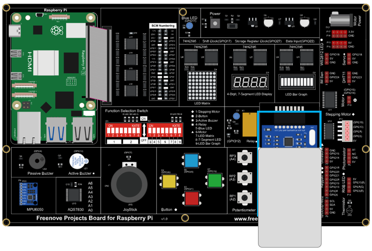

.. note::
    
    :red:`If you have any concerns, please send an email to:` support@freenove.com

Configure SPI
================================================================

Enable SPI
----------------------------------------------------------------

The SPI interface of raspberry pi is closed by default. You need to open it manually. You can enable the SPI interface in the following way.

Type the following command in the terminal:

.. code-block:: console

    $ sudo raspi-config

Then open the following dialog box:

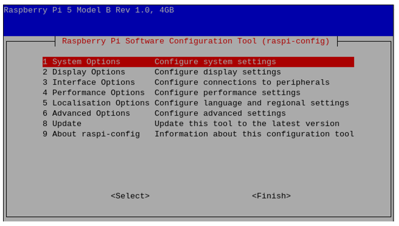

Choose "3 Interfacing Options" -> "I4 SPI" -> "Yes" -> "Finish" in order and then restart your RPi. Then the SPI module is started.

Type the following command to check whether the module SPI is loaded successfully:

.. code-block:: console

    $ ls /dev/sp*

The following result indicates that the module SPI has been loaded successfully:

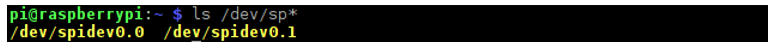

Code
================================================================

The project code uses human-computer interaction command line mode to read and write the M1-S50 card.

C Code 25.1 RFID
----------------------------------------------------------------

First observe the running result, and then learn about the code in detail.

.. note::
    
    :red:`If you have any concerns, please send an email to:` support@freenove.com

1.	Use cd command to enter 25_RFID directory of C code.

.. code-block:: console

    $ cd ~/Freenove_Kit/Code/C_Code/25_RFID

2.	Use the following command to compile and generate executable file "RFID". 

.. code-block:: console

    $ sh ./build.sh

3.	Then run the generated file "RFID".

.. code-block:: console

    $ ./RFID

After the program runs, the following contents will be displayed in the terminal:

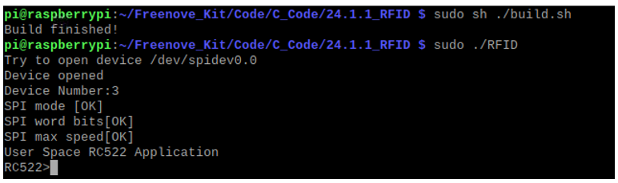

Here, type the command “quit” to exit the program.

Type command "scan", and then the program begins to detect whether there is a card close to the sensing area of MFRC522 reader. Place a M1-S50 card in the sensing area. The following results indicate that the M1-S50 card has been detected, the UID of which is E6CF5C8EFB (HEX).

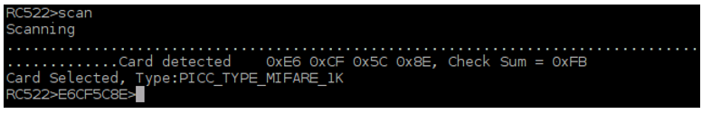

When the Card is placed in the sensing area, you can read and write the card with the following command.

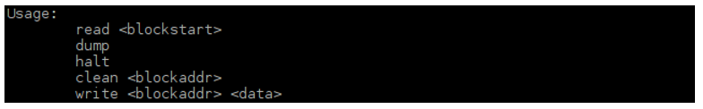

In the command read<blockstart>, the parameter blockstart is the address of the data block, and the range is 0-63. This command is used to display all the data from blockstart address to the end of the sector. For example, sector 0 contains data block 0,1,2,3. Using the command “read 0” can display all contents of data block 0,1,2,3. Using the command “read 1” can display all contents of data block 1,2,3. As is shown below:

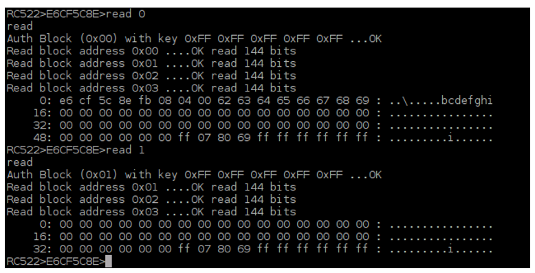

Command “dump” is used to display the content of all data blocks in all sectors.

Command <address> <data> is used to write “data" to data block with address “address”, where the address range is 0-63 and the data length is 0-16. For example, if you want to write the string "Freenove" to the data block with address “1”, you can type the following command.

.. code-block:: console

    write 1 Freenove

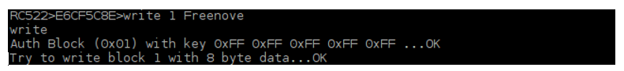

Read the contents of this sector and check the data just written.

.. code-block:: console

    read 0

The following results indicate that the string "Freenove" has been written successfully into the data block 1.

Command “clean <address>” is used to remove the contents of the data block with address "address". For example, if you want to clear the contents of the data block 1 that has just been written, you can type the following command.

.. code-block:: console

    clean 1

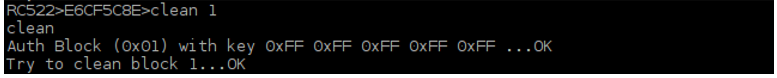

Read the contents of data blocks in this sector again to check whether the data is erased. The following results indicate that the contents of data block 1 have been erased.

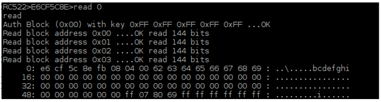

Command “halt” is used to quit the selection state of the card.

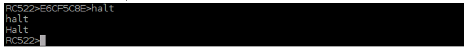

The following is the program code:

.. literalinclude:: ../../../freenove_Kit/Code/C_Code/25_RFID/main.c
    :linenos: 
    :language: c

In the code, first initialize the MFRC522. If the initialization fails, the program will exit.

.. literalinclude:: ../../../freenove_Kit/Code/C_Code/25_RFID/main.c
    :linenos: 
    :language: c
    :lines: 31-35

In the main function, wait for the command input. If command "scan" is received, the function will begin to detect whether there is a card close to the sensing area. If a card is detected, the card will be selected and card UID will be acquired. Then enter the function scan_loop (). If command "quit" or "exit" is received, the program will exit.

.. literalinclude:: ../../../freenove_Kit/Code/C_Code/25_RFID/main.c
    :linenos: 
    :language: c
    :lines: 43-80

The function scan_loop() will detect command read, write, clean, halt, dump and do the corresponding processing to each command. The functions of each command and the method have been introduced before.

.. literalinclude:: ../../../freenove_Kit/Code/C_Code/25_RFID/main.c
    :linenos: 
    :language: c
    :lines: 83-134

Python Code 25.1 RFID
----------------------------------------------------------------

First observe the project result, and then learn about the code in detail.

.. note::
    
    :red:`If you have any concerns, please send an email to:` support@freenove.com

.. code-block:: console

    $ cd ~/Freenove_Kit/Code/Python_GPIOZero_Code/25_RFID/Python3

1.	Use python command to execute code "RFID.py".

.. code-block:: console

    $ python RFID.py

After the program runs, the following contents will be displayed in the terminal:

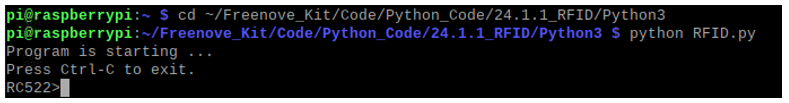

Here, type the command “quit” to exit the program.

Type command "scan", then the program begins to detect whether there is a card close to the sensing area of MFRC522 reader. Place a M1-S50 card in the sensing area. The following results indicate that the M1-S50 card has been detected, the UID of which is E6CF5C8EFB (HEX).

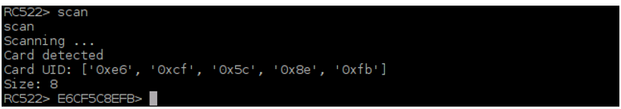

When the Card is placed in the sensing area, you can read and write the card with the following command.

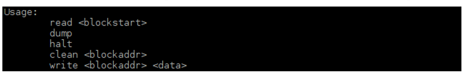

In the command read<blockstart>, the parameter blockstart is the address of the data block, and the range is 0-63. As is shown below:   

In the command read<blockstart>, the parameter blockstart is the address of the data block, and the range is 0-63. This command is used to read the data of data block with address “blockstart”. For example, using command “read 0” can display the content of data block 0. Using the command “read 1” can display the content of data block 1. As is shown below:   

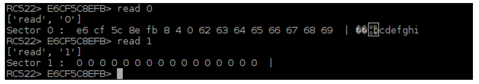

Command “dump” is used to display the content of all data blocks in all sectors.

Command <address> <data> is used to write “data" to data block with address “address”, where the address range is 0-63 and the data length is 0-16. In the process of writing data to the data block, both the contents of data block before written and after written will be displayed. For example, if you want to write the string "Freenove" to the data block with address “1”, you can type the following command.

.. code-block:: console

    write 1 Freenove

.. image:: ../_static/imgs/25_RFID/Chapter25_18.png
    :align: center

Command "clean <address>" is used remove the contents of the data block with address "address". For example, if you want to clear the contents of the data block 1 that has just been written, you can type the following command.

.. code-block:: console

    clean 1

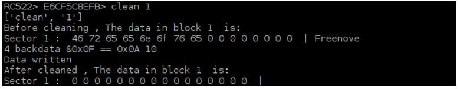

Command “halt” is used to quit the selection state of the card.

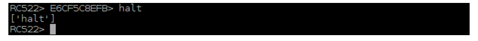

The following is the program code :

.. literalinclude:: ../../../freenove_Kit/Code/Python_GPIOZero_Code/25_RFID/RFID.py
    :linenos: 
    :language: python

In the code, first create an MFRC522 class object.

.. literalinclude:: ../../../freenove_Kit/Code/Python_GPIOZero_Code/25_RFID/RFID.py
    :linenos: 
    :language: python
    :lines: 14-14

In the function loop, wait for the command input. If command "scan" is received, the function will begin to detect whether there is a card close to the sensing area. If a card is detected, the card will be selected and card UID will be acquired. Then enter the function scan_loop (). If command "quit" or "exit" is received, the program will exit.

.. literalinclude:: ../../../freenove_Kit/Code/Python_GPIOZero_Code/25_RFID/RFID.py
    :linenos: 
    :language: python
    :lines: 32-57

The function cmdloop() will detect command read, write, clean, halt, dump and do the corresponding processing to each command. The functions of each command and the method have been introduced before.

.. literalinclude:: ../../../freenove_Kit/Code/Python_GPIOZero_Code/25_RFID/RFID.py
    :linenos: 
    :language: python
    :lines: 59-138

The file "MFRC522.py" contains the associated operation method for the MFRC522. You can open the file to view all the definitions and functions.