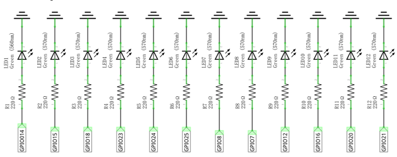
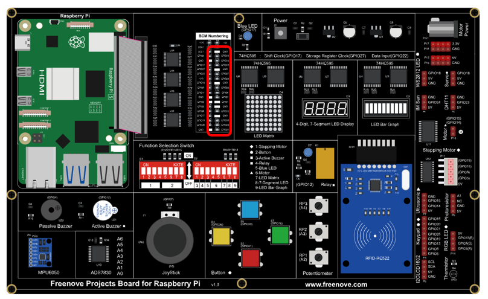

##############################################################################
Chapter FlowingLight
##############################################################################

We have learned how to control one LED to blink. Next, we will learn how to control a number of LEDs.

Project Flowing Water Light
****************************************************************

In this project, we use a number of LEDs to make a flowing water light.

Component List
================================================================

+------------------------------------------+
| Freenove Projects Board for Raspberry Pi |
|                                          |
|  |Chapter01_04|                          |
+---------------------+--------------------+
| Raspberry Pi        | GPIO Ribbon Cable  |
|                     |                    |
|  |Chapter01_05|     |  |Chapter01_06|    |
+---------------------+--------------------+

.. |Chapter01_04| image:: ../_static/imgs/1_LED/Chapter01_04.png
.. |Chapter01_05| image:: ../_static/imgs/1_LED/Chapter01_05.png
.. |Chapter01_06| image:: ../_static/imgs/1_LED/Chapter01_06.png

Circuit
================================================================

.. list-table:: 
    :width: 100%
    :align: center
    :class: product-table

    *   -   Schematic diagram
    *   -   |Chapter02_00|
    *   -   Hardware connection:
    *   -   |Chapter02_01|

.. note::
    
    :red:`If you have any concerns, please send an email to:` support@freenove.com

Code
================================================================

C Code 2.1 LightWater
----------------------------------------------------------------

First, observe the project result, and then learn about the code in detail.

.. note::
    
    :red:`If you have any concerns, please send an email to:` support@freenove.com

1.	Use cd command to enter 2_FlowingLight directory of C code.

.. code-block:: console
    
    $ cd ~/Freenove_Kit/Code/C_Code/2_FlowingLight

2.	Use the following command to compile “LightWater.c” and generate executable file “LightWater”.

.. code-block:: console
    
    $ gcc FlowingLight.c -o FlowingLight -lwiringPi

3.	Then run the generated file “LightWater”.

.. code-block:: console
    
    $ ./FlowingLight

You can see the LEDs lighting from top to bottom and then back from bottom to top.

The following is the program code:

.. literalinclude:: ../../../freenove_Kit/Code/C_Code/2_FlowingLight/FlowingLight.c
    :linenos: 
    :language: c

In the “while” loop, apply two “for” loop to achieve the flowing water light lighting from top to bottom and then back from bottom to top.

.. literalinclude:: ../../../freenove_Kit/Code/C_Code/2_FlowingLight/FlowingLight.c
    :linenos: 
    :language: c
    :lines: 21-32

Python Code 2.1 LightWater
----------------------------------------------------------------

First observe the project result, and then learn about the code in detail.

If you have any concerns, please send an email to: support@freenove.com

1. Use cd command to enter 2_FlowingLight directory of Python code.

.. code-block:: console
    
    $ cd ~/Freenove_Kit/Code/Python_GPIOZero_Code/2_FlowingLight

2. Use Python command to execute Python code “LightWater.py”.

.. code-block:: console
    
    $ python LightWater.py

You can see the LEDs lighting from top to bottom and then back from bottom to top.

The following is the program code:

.. literalinclude:: ../../../freenove_Kit/Code/Python_GPIOZero_Code/2_FlowingLight/LightWater.py
    :linenos: 
    :language: python

In the “while” loop, apply two “for” loop to achieve the flowing water light lighting from top to bottom and then back from bottom to top.

.. literalinclude:: ../../../freenove_Kit/Code/Python_GPIOZero_Code/2_FlowingLight/LightWater.py
    :linenos: 
    :language: python
    :lines: 14-23