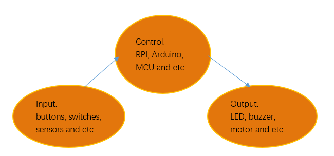

##############################################################################
Chapter Buttons & LEDs
##############################################################################

Usually, there are three essential parts in a complete automatic control device: INPUT, OUTPUT, and CONTROL. In last section, the LED module was the output part and RPI was the control part. In practical applications, we not only make LEDs flash, but also make a device sense the surrounding environment, receive instructions and then take the appropriate action such as turn on LEDs, make a buzzer beep and so on.

Next, we will build a simple control system to control an LED through a push button switch.

Project Push Button Switch & LED
****************************************************************

In the project, we will control the LED state through a Push Button Switch. When the button is pressed, our LED will turn ON, and when it is released, the LED will turn OFF. This describes a Momentary Switch.

Component knowledge
================================================================

Push Button Switch 
----------------------------------------------------------------

This type of Push Button Switch has 4 pins (2 Pole Switch). Two pins on the left are connected, and both left and right sides are the same as per the illustration:

.. image:: ../_static/imgs/3_Buttons_&_LEDs/Chapter03_01.png
    :align: center

When the button on the switch is pressed, the circuit is completed (your project is Powered ON).

Component List
================================================================

+------------------------------------------+
| Freenove Projects Board for Raspberry Pi |
|                                          |
|  |Chapter01_04|                          |
+---------------------+--------------------+
| Raspberry Pi        | GPIO Ribbon Cable  |
|                     |                    |
|  |Chapter01_05|     |  |Chapter01_06|    |
+---------------------+--------------------+

.. |Chapter01_04| image:: ../_static/imgs/1_LED/Chapter01_04.png
.. |Chapter01_05| image:: ../_static/imgs/1_LED/Chapter01_05.png
.. |Chapter01_06| image:: ../_static/imgs/1_LED/Chapter01_06.png

Circuit
================================================================

.. list-table:: 
    :width: 100%
    :align: center
    :class: product-table

    *   -   Schematic diagram
    *   -   |Chapter03_02|
    *   -   Hardware connection:
           
            Switch ON NO.5 switch and the four switches of NO.2.

    *   -   |Chapter03_03|

.. |Chapter03_02| image:: ../_static/imgs/3_Buttons_&_LEDs/Chapter03_02.png
.. |Chapter03_03| image:: ../_static/imgs/3_Buttons_&_LEDs/Chapter03_03.png

.. note::
    
    :red:`If you have any concerns, please send an email to:` support@freenove.com

Code
================================================================

This project is designed for learning how to use Push Button Switch to control an LED. We first need to read the state of switch, and then determine whether to turn the LED ON in accordance to the state of the switch.

C Code 3.1 ButtonLED
----------------------------------------------------------------

First, observe the project result, then learn about the code in detail. 

.. note::
    
    :red:`If you have any concerns, please send an email to:` support@freenove.com

1.	Use cd command to enter 3_ButtonLED directory of C code.

.. code-block:: console
    
    $ cd ~/Freenove_Kit/Code/C_Code/3_ButtonLED

2.	Use the following command to compile the code “ButtonLED.c” and generate executable file “ButtonLED”

.. code-block:: console
    
    $ gcc ButtonLED.c -o ButtonLED -lwiringPi

3.	Then run the generated file “ButtonLED”.

.. code-block:: console
    
    $ ./ButtonLED

Later, the terminal window continues to print out the characters “led off…”. Press the S4 button, then LED is turned on and then terminal window prints out the "led on…". Release the button, then LED is turned off and then terminal window prints out the "led off…". You can press "Ctrl+C" to terminate the program.

The following is the program code:

.. literalinclude:: ../../../freenove_Kit/Code/C_Code/3_ButtonLED/ButtonLED.c
    :linenos: 
    :language: c

Define ledPin and buttonPin as 17 and 26 respectively.

.. code-block:: c
    
    #define ledPin    17 	//define the ledPin
    #define buttonPin 26  //define the buttonPin

In the while loop of main function, use digitalRead(buttonPin) to determine the state of Button. When the button is pressed, the function returns low level, the result of “if” is true, and then turn on LED. Or, turn off LED.

.. literalinclude:: ../../../freenove_Kit/Code/C_Code/3_ButtonLED/ButtonLED.c
    :linenos: 
    :language: c
    :lines: 24-31

Reference
^^^^^^^^^^^^^^^^^^^^^^^^^^^^^^^^^^^^^^^^^^^^^^^^^^^^^^^^^^^^

.. c:function:: int digitalRead (int pin);

    This function returns the value read at the given pin. It will be “HIGH” or “LOW”(1 or 0) depending on the logic level at the pin.

Python Code 3.1 ButtonLED
----------------------------------------------------------------

First, observe the project result, then learn about the code in detail. Remember in code “button” = switch function

.. note::
    
    :red:`If you have any concerns, please send an email to:` support@freenove.com

1.	Use cd command to enter 3_ButtonLED directory of Python code.

.. code-block:: console
    
    $ cd ~/Freenove_Kit/Code/Python_GPIOZero_Code/3_ButtonLED

2.	Use Python command to execute btnLED.py.

.. code-block:: console
    
    $ python ButtonLED.py

Then the Terminal window continues to show the characters “led off…”, press the switch button and the LED turns ON and then Terminal window shows "led on…". Release the button, then LED turns OFF and then the terminal window text "led off…" appears. You can press "Ctrl+C" at any time to terminate the program.

The following is the program code:

.. literalinclude:: ../../../freenove_Kit/Code/Python_GPIOZero_Code/3_ButtonLED/ButtonLED.py
    :linenos: 
    :language: python

Apply for an led module to control the LED, apply for a Button module to read the status of the button.

.. code-block:: python
    
    led = LED(17)       # define LED pin according to BCM Numbering
    button = Button(26) # define Button pin according to BCM Numbering

The loop continues endlessly to judge whether the key is pressed. When the button is detected to be pressed, let the LED light up and set the key status value to 1 to ensure that it does not trigger again. When the button release is detected, let the LED go off and set the key status value to 0 to ensure that it does not trigger again.

.. literalinclude:: ../../../freenove_Kit/Code/Python_GPIOZero_Code/3_ButtonLED/ButtonLED.py
    :linenos: 
    :language: python
    :lines: 13-23

Release the GPIO resource each time you use Ctrl+C to exit the code.

.. code-block:: python
    
    finally:
        led.close()
        button.close()