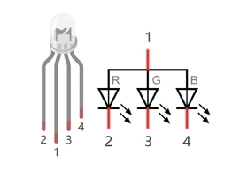
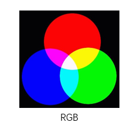
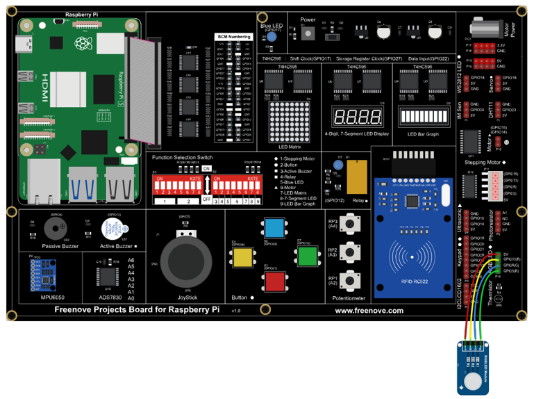

##############################################################################
Chapter RGB LED
##############################################################################

In this chapter, we will learn how to control an RGB LED.

An RGB LED has 3 LEDs integrated into one LED component. It can respectively emit Red, Green and Blue light. In order to do this, it requires 4 pins (this is also how you identify it). The long pin (1) is the common which is the Anode (+) or positive lead, the other 3 are the Cathodes (-) or negative leads. A rendering of an RGB LED and its electronic symbol are shown below. We can make RGB LED emit various colors of light and brightness by controlling the 3 Cathodes (2, 3 & 4) of the RGB LED

    
Red, Green, and Blue light are called 3 Primary Colors when discussing light (Note: for pigments such as paints, the 3 Primary Colors are Red, Blue and Yellow). When you combine these three Primary Colors of light with varied brightness, they can produce almost any color of visible light. Computer screens, single pixels of cell phone screens, neon lamps, etc. can all produce millions of colors due to phenomenon.

    
If we use a three 8 bit PWM to control the RGB LED, in theory, we can create 28*28*28=16777216 (16 million) colors through different combinations of RGB light brightness.

Next, we will use RGB LED to make a multicolored LED. 

Project 5.1 RainbowLED
****************************************************************

In this project, we will make a multicolored LED, which we can program the RGB LED to automatically change colors.

Component List
================================================================

+------------------------------------------+
| Freenove Projects Board for Raspberry Pi |
|                                          |
|  |Chapter01_04|                          |
+---------------------+--------------------+
| Raspberry Pi        | GPIO Ribbon Cable  |
|                     |                    |
|  |Chapter01_05|     |  |Chapter01_06|    |
+---------------------+--------------------+
| Jumper Wire         | RGBLED Module      |
|                     |                    |
|  |Chapter05_02|     |  |Chapter05_03|    |
+---------------------+--------------------+

.. |Chapter01_04| image:: ../_static/imgs/1_LED/Chapter01_04.png
.. |Chapter01_05| image:: ../_static/imgs/1_LED/Chapter01_05.png
.. |Chapter01_06| image:: ../_static/imgs/1_LED/Chapter01_06.png
.. |Chapter05_02| image:: ../_static/imgs/5_RGB_LED/Chapter05_02.png
.. |Chapter05_03| image:: ../_static/imgs/5_RGB_LED/Chapter05_03.png

Circuit
================================================================

.. list-table:: 
    :width: 100%
    :align: center
    :class: product-table

    *   -   Schematic diagram
    *   -   |Chapter05_04|
    *   -   Hardware connection:
    *   -   |Chapter05_05|

.. note::
    
    :red:`If you have any concerns, please send an email to:` support@freenove.com

Code
================================================================

We need to use the software to make the ordinary GPIO output PWM, since this project requires 3 PWM and in RPi only one GPIO has the hardware capability to output PWM,

C Code 5.1 RainbowLED
----------------------------------------------------------------

First, observe the project result, and then learn about the code in detail.

If you have any concerns, please send an email to: support@freenove.com

1.	Use cd command to enter 5_ RainbowLED directory of C code.

.. code-block:: console

    $ cd ~/Freenove_Kit/Code/C_Code/5_RainbowLED

2.	Use following command to compile “RainbowLED.c” and generate executable file “RainbowLED”.

.. note::
    
    In this project, the software PWM uses a multi-threading mechanism. So “-lpthread” option need to be add to the compiler.

.. code-block:: console

    $ gcc RainbowLED.c -o RainbowLED -lwiringPi -lpthread

3.	And then run the generated file “ColorfulLED”.

.. code-block:: console

    $ ./RainbowLED

After the program is executed, you will see that the RGB LED shows lights of different colors randomly.

The following is the program code:

.. literalinclude:: ../../../freenove_Kit/Code/C_Code/5_RainbowLED/RainbowLED.c
    :linenos: 
    :language: c

First, in subfunction of ledInit(), create the software PWM control pins used to control the R, G, B pin respectively.

.. literalinclude:: ../../../freenove_Kit/Code/C_Code/5_RainbowLED/RainbowLED.c
    :linenos: 
    :language: c
    :lines: 16-21

Then create subfunction, and set the PWM of three pins.

.. literalinclude:: ../../../freenove_Kit/Code/C_Code/5_RainbowLED/RainbowLED.c
    :linenos: 
    :language: c
    :lines: 23-28

Finally, in the “while” loop of main function, get three random numbers and specify them as the PWM duty cycle, which will be assigned to the corresponding pins. So RGB LED can switch the color randomly all the time.

.. literalinclude:: ../../../freenove_Kit/Code/C_Code/5_RainbowLED/RainbowLED.c
    :linenos: 
    :language: c
    :lines: 39-46

The related function of PWM Software can be described as follows:

.. c:function:: long random();

    This function will return a random number.

For more details about Software PWM, please refer to: https://github.com/WiringPi/WiringPi

Python Code 5.1 RainbowLED
----------------------------------------------------------------

First, observe the project result, and then learn about the code in detail.

.. note::
    
    :red:`If you have any concerns, please send an email to:` support@freenove.com

1.	Use cd command to enter 5_RainbowLED directory of Python code.

.. code-block:: console

    $ cd ~/Freenove_Kit/Code/Python_GPIOZero_Code/5_RainbowLED

2.	Use python command to execute python code “ColorfulLED.py”.

.. code-block:: console

    $ python RainbowLED.py

After the program is executed, you will see that the RGB LED randomly lights up different colors.

The following is the program code:

.. literalinclude:: ../../../freenove_Kit/Code/Python_GPIOZero_Code/5_RainbowLED/RainbowLED.py
    :linenos: 
    :language: py

In last chapter, we learned how to use Python language to make a pin output PWM. In this project, we output to three pins via PWM and the method is exactly the same as we used in the last chapter. In the “while” loop of “loop” function, we first generate three random numbers, and then specify these three random numbers as the PWM values for the three pins, which will make the RGB LED produce multiple colors randomly.

.. literalinclude:: ../../../freenove_Kit/Code/Python_GPIOZero_Code/5_RainbowLED/RainbowLED.py
    :linenos: 
    :language: py
    :lines: 19-26
