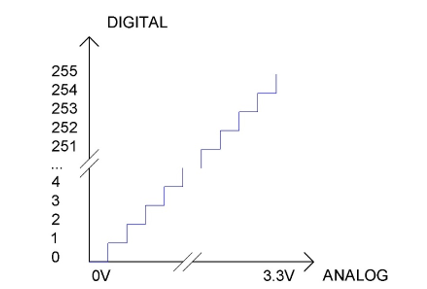
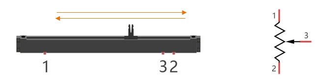
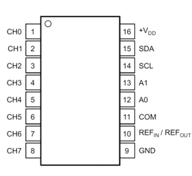
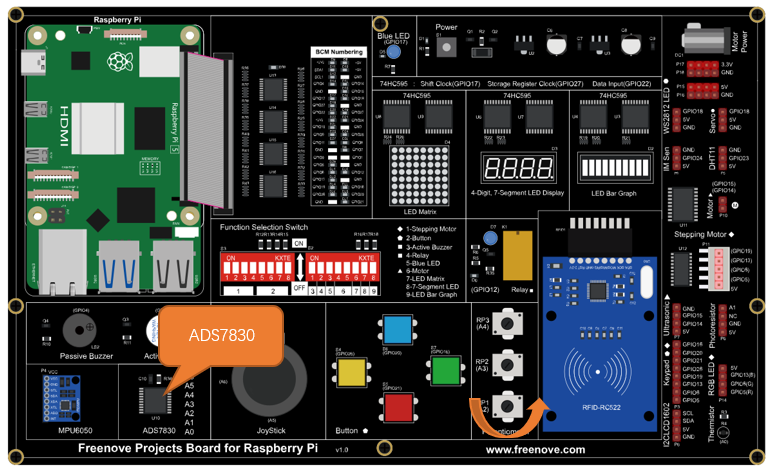
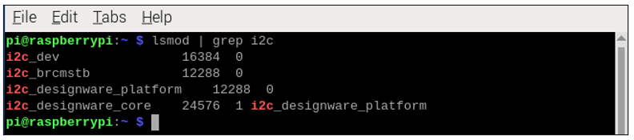
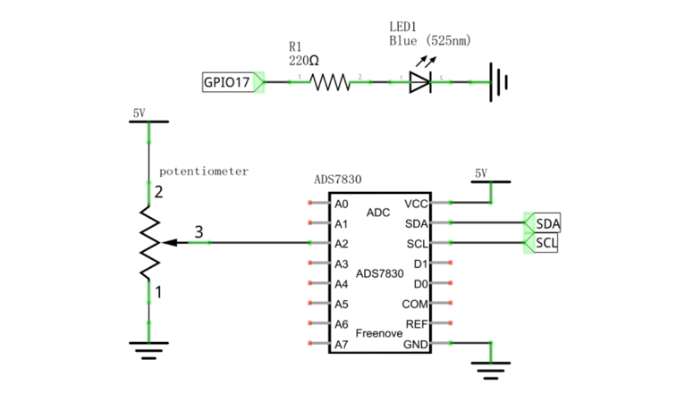

.. _ADC:

##############################################################################
Chapter (Important) Chapter ADC
##############################################################################

We have learned how to control the brightness of an LED through PWM and that PWM is not a real analog signal. In this chapter, we will learn how to read analog values via an ADC Module and convert these analog values into digital.

Project 7.1 Read the Voltage of Potentiometer 
****************************************************************

In this project, we will use the ADC function of an ADC Module to read the voltage value of a potentiometer. 

Circuit knowledge
================================================================

ADC
----------------------------------------------------------------

**An ADC is an electronic integrated circuit used to convert analog signals such as voltages to digital or binary form consisting of 1s and 0s.** The range of our ADC module is 8 bits, that means the resolution is 2^8=256, so that its range (at 3.3V) will be divided equally to 256 parts. 

Any analog value can be mapped to one digital value using the resolution of the converter. So the more bits the ADC has, the denser the partition of analog will be and the greater the precision of the resulting conversion.

Subsection 1: the analog in range of 0V-3.3/256 V corresponds to digital 0;

Subsection 2: the analog in range of 3.3 /256 V-2*3.3 /256V corresponds to digital 1;

The resultant analog signal will be divided accordingly.

DAC
----------------------------------------------------------------

The reversing this process requires a DAC, Digital-to-Analog Converter. The digital I/O port can output high level and low level (0 or 1), but cannot output an intermediate voltage value. This is where a DAC is useful. The DAC module PCF8591 has a DAC output pin with 8-bit accuracy, which can divide VDD (here is 3.3V) into 28=256 parts. For example, when the digital quantity is 1, the output voltage value is 3.3/256 *1 V, and when the digital quantity is 128, the output voltage value is 3.3/256 *128=1.65V, the higher the accuracy of DAC, the higher the accuracy of output voltage value will be.

Component knowledge
================================================================

Potentiometer
----------------------------------------------------------------

Potentiometer is a resistive element with three Terminal parts. Unlike the resistors that we have used thus far in our project which have a fixed resistance value, the resistance value of a potentiometer can be adjusted. A potentiometer is often made up by a resistive substance (a wire or carbon element) and movable contact brush. When the brush moves along the resistor element, there will be a change in the resistance of the potentiometer’s output side (3) (or change in the voltage of the circuit that is a part). The illustration below represents a linear sliding potentiometer and its electronic symbol on the right.

Between potentiometer pin 1 and pin 2 is the resistive element (a resistance wire or carbon) and pin 3 is connected to the brush that makes contact with the resistive element. In our illustration, when the brush moves from pin 1 to pin 2, the resistance value between pin 1 and pin 3 will increase linearly (until it reaches the highest value of the resistive element) and at the same time the resistance between pin 2 and pin 3 will decrease linearly and conversely down to zero. At the midpoint of the slider the measured resistance values between pin 1 and 3 and between pin 2 and 3 will be the same.

In a circuit, both sides of resistive element are often connected to the positive and negative electrodes of power. When you slide the brush “pin 3”, you can get variable voltage within the range of the power supply.

.. image:: ../_static/imgs/7_ADC/Chapter07_02.png
    :align: center

Rotary potentiometer
----------------------------------------------------------------

Rotary potentiometers and linear potentiometers have the same function; the only difference being the physical action being a rotational rather than a sliding movement.

ADS7830
----------------------------------------------------------------

The ADS7830 is a single-supply, low-power, 8-bit data acquisition device that features a serial I2C interface and an 8-channel multiplexer. The following table is the pin definition diagram of ADS7830.

+-----------+-----+---------------------------------------------------+-----------------------------------------------+
| SYMBOL    | PIN |                    DESCRIPTION                    |                    TOP VIEW                   |
+===========+=====+===================================================+===============================================+
|  CH0      |  1  |                                                   |                                               |
+-----------+-----+                                                   |                                               |
|  CH1      |  2  |                                                   |                                               |
+-----------+-----+                                                   |                                               |
|  CH2      |  3  |                                                   |                                               |
+-----------+-----+                                                   |                                               |
|  CH3      |  4  |                                                   |                                               |                                               
+-----------+-----+       Analog input channels  (A/D converter)      |                                               |
|  CH4      |  5  |                                                   |                                               |
+-----------+-----+                                                   |                                               |
|  CH5      |  6  |                                                   |                                               |
+-----------+-----+                                                   |                                               |
|  CH6      |  7  |                                                   |                                               |
+-----------+-----+                                                   |                                               |
|  CH7      |  8  |                                                   ||Chapter07_03|                                  |
+-----------+-----+---------------------------------------------------+                                               |
|  GND      |  9  |   Ground                                          |                                               |
+-----------+-----+---------------------------------------------------+                                               |
|           |     | Internal +2.5V Reference,External                 |                                               |
|REF in/out |  10 |                                                   |                                               |
|           |     | Reference Input                                   |                                               |
+-----------+-----+---------------------------------------------------+                                               |
|  COM      |  11 |   Common to Analog Input Channel                  |                                               |
+-----------+-----+---------------------------------------------------+                                               |
|  A0       |  12 |                                                   |                                               |
+-----------+-----+   Hardware address                                |                                               |
|  A1       |  13 |                                                   |                                               |
+-----------+-----+---------------------------------------------------+                                               |
|  SCL      |  14 |   Serial Clock                                    |                                               |
+-----------+-----+---------------------------------------------------+                                               |
|  SDA      |  15 |   Serial Sata                                     |                                               |
+-----------+-----+---------------------------------------------------+                                               |
|  +VDD     |  16 |   Power Supply, 3.3V Nominal                      |                                               |
+-----------+-----+---------------------------------------------------+-----------------------------------------------+

I2C communication
----------------------------------------------------------------

I2C (Inter-Integrated Circuit) has a two-wire serial communication mode, which can be used to connect a micro-controller and its peripheral equipment. Devices using I2C communications must be connected to the serial data line (SDA), and serial clock line (SCL) (called I2C bus). Each device has a unique address which can be used as a transmitter or receiver to communicate with devices connected via the bus.

Component List
================================================================

+------------------------------------------+
| Freenove Projects Board for Raspberry Pi |
|                                          |
|  |Chapter01_04|                          |
+---------------------+--------------------+
| Raspberry Pi        | GPIO Ribbon Cable  |
|                     |                    |
|  |Chapter01_05|     |  |Chapter01_06|    |
+---------------------+--------------------+

.. |Chapter01_04| image:: ../_static/imgs/1_LED/Chapter01_04.png
.. |Chapter01_05| image:: ../_static/imgs/1_LED/Chapter01_05.png
.. |Chapter01_06| image:: ../_static/imgs/1_LED/Chapter01_06.png

Circuit
================================================================

.. list-table:: 
    :width: 100%
    :align: center
    :class: product-table

    *   -   Schematic diagram
    *   -   |Chapter07_04|
    *   -   Hardware connection:
    *   -   |Chapter07_05|

.. |Chapter07_04| image:: ../_static/imgs/7_ADC/Chapter07_04.png

Configure I2C and Install Smbus 
================================================================

Enable I2C
----------------------------------------------------------------

The I2C interface in Raspberry Pi is disabled by default. You will need to open it manually and enable the I2C interface as follows:

Type command in the Terminal:

.. code-block:: console

    $ sudo raspi-config

Then open the following dialog box:

.. image:: ../_static/imgs/7_ADC/Chapter07_06.png
    :align: center

Choose “Interfacing Options” then “I5 I2C” then “Yes” and then “Finish” in this order and restart your RPi. The I2C module will then be started.

Type a command to check whether the I2C module is started:

.. code-block:: console

    $ lsmod | grep i2c

If the I2C module has been started, the following content will be shown. 

Different models of Raspberry Pi display different contents depending on the CPU installed:

Install I2C-Tools
----------------------------------------------------------------

Next, type the command to install I2C-Tools. It is available with the Raspberry Pi OS by default.

.. code-block:: console

    $ sudo apt-get install i2c-tools
    $ sudo apt-get install python3-smbus

I2C device address detection:

.. code-block:: console

    $ i2cdetect -y 1

When you are using the ADS7830 Module, the result should look like this:

.. image:: ../_static/imgs/7_ADC/Chapter07_08.png
    :align: center

Here, 48 (HEX) is the I2C address of ADC Module (ADS7830).

Code
================================================================

C Code 7.1 ADC
----------------------------------------------------------------

For C code for the ADC Device, a custom library needs to be installed.

.. note::
    
    :red:`If you have any concerns, please send an email to:` support@freenove.com

1.	Use cd command to enter folder of the ADC Device library.

.. code-block:: console

    $ cd ~/Freenove_Kit/Libs/C-Libs/ADCDevice

2.	Execute command below to install the library.

.. code-block:: console

    $ sh ./build.sh

A successful installation, without error prompts, is shown below:

Next, we will execute the code for this project. 

First, observe the project result, and then learn about the code in detail.

.. note::
    
    :red:`If you have any concerns, please send an email to:` support@freenove.com

1.	Use cd command to enter 7_1_ADC directory of C code.

.. code-block:: console

    $ cd ~/Freenove_Kit/Code/C_Code/7_1_ADC

2.	Use following command to compile “ADC.cpp” and generate the executable file “ADC”.

.. code-block:: console

    $ g++ ADC.cpp -o ADC -lwiringPi -lADCDevice

3.	Then run the generated file “ADC”.

.. code-block:: console

    $ ./ADC

After the program is executed, adjusting the potentiometer will produce a readout display of the potentiometer voltage values in the Terminal and the converted digital content. 

The following is the code:

.. literalinclude:: ../../../freenove_Kit/Code/C_Code/7_1_ADC/ADC.cpp
    :linenos: 
    :language: c

In this code, a custom class library "ADCDevice" is used. It contains the method of utilizing the ADC Module in this project, through which the ADC Module can easily and quickly be used. In the code, you need to first create a class pointer adc, and then point to an instantiated object. (Note: An instantiated object is given a name and created in memory or on disk using the structure described within a class declaration.)

.. code-block:: c

    ADCDevice *adc;  // Define an ADC Device class object
    ......
    adc = new ADCDevice();

Then use the member function detectIC(addr) in the class to detect the I2C module in the circuit. Different modules have different I2C addresses. The default address of ADC module ADS7830 is 0x48.

.. literalinclude:: ../../../freenove_Kit/Code/C_Code/7_1_ADC/ADC.cpp
    :linenos: 
    :language: c
    :lines: 16-25

When you have a class object pointed to a specific device, you can get the ADC value of the specific channel by calling the member function analogRead (chn) in this class

.. code-block:: c

    int adcValue = adc->analogRead(2);    //read analog value of A2 pin

Then according to the formula, the voltage value is calculated and displayed on the Terminal.

.. code-block:: c

    float voltage = (float)adcValue / 255.0 * 5.0;  // Calculate voltage
    printf("ADC value : %d  ,\tVoltage : %.2fV\n",adcValue,voltage);

Reference
^^^^^^^^^^^^^^^^^^^^^^^^^^^^^^^^^^^^^^^^^^^^^^^^^^^^^^^^^^^^^^^^^^^^^^^^^^^^^^

.. c:function:: class ADCDevice

    This is a base class. All ADC module classes are its derived classes. It has a real function and a virtual function.

    **int detectI2C** (int addr);
    
    This is a real function, which is used to detect whether the device with given I2C address exists. If it exists, return 1, otherwise return 0.

    **virtual int analogRead** (int chn);
    
    This is a virtual function that reads the ADC value of the specified channel. It is implemented in a derived class.

.. c:function:: class ADS7830:public ADCDevice	

    These classes are derived from the ADCDevice class and mainly implement the function analogRead(chn).

    **int analogRead** (int chn);
    
    This returns the value read on the supplied analog input pin.
    
    Parameter ADS7830, the range of is 0, 1, 2, 3, 4, 5, 6, 7.

Python Code 7.1 ADC
----------------------------------------------------------------

For Python code, ADCDevice requires a custom module which needs to be installed.

.. note::
    
    :red:`If you have any concerns, please send an email to:` support@freenove.com

1.	Use cd command to enter folder of ADCDevice.

.. code-block:: console

    $ cd ~/Freenove_Kit/Libs/Python-Libs

2.	Open the unzipped folder.

.. code-block:: console

    $ cd ADCDevice-1.0.4

3.	Install library for python2 and python3.

.. code-block:: console

    $ sudo python3 setup.py install 

A successful installation, without error prompts, is shown below:

Execute the following command. Observe the project result and then learn about the code in detail.

.. note::
    
    :red:`If you have any concerns, please send an email to:` support@freenove.com

1. Use cd command to enter 7_1_ADC directory of Python code.

.. code-block:: console

    $ cd ~/Freenove_Kit/Code/Python_GPIOZero_Code/7_1_ADC

2. Use the Python command to execute the Python code “ADC.py”.

.. code-block:: console

    $ python ADC.py

After the program is executed, adjusting the potentiometer will produce a readout display of the potentiometer voltage values in the Terminal and the converted digital content. 

The following is the code:

.. literalinclude:: ../../../freenove_Kit/Code/Python_GPIOZero_Code/7_1_ADC/ADC.py
    :linenos: 
    :language: python

In this code, a custom Python module "ADCDevice" is used. It contains the method of utilizing the ADC Module in this project, through which the ADC Module can easily and quickly be used. In the code, you need to first create an ADCDevice object adc.

.. code-block:: python

    adc = ADCDevice(0x48) # Define an ADCDevice class object

Then in setup(), use detecticIC(addr), the member function of ADCDevice, to detect the I2C module in the circuit. The default address of ADS7830 is 0x48.

.. literalinclude:: ../../../freenove_Kit/Code/Python_GPIOZero_Code/7_1_ADC/ADC.py
    :linenos: 
    :language: python
    :lines: 13-21

When you have a class object of a specific device, you can get the ADC value of the specified channel by calling the member function of this class, analogRead(chn). In loop(), get the ADC value of potentiometer.

.. code-block:: python

    value = adc.analogRead(2)    # read the ADC value of channel 2

Then according to the formula, the voltage value is calculated and displayed on the terminal monitor.

.. code-block:: python

    voltage = value / 255.0 * 5.0  # calculate the voltage value
    print ('ADC Value : %d, Voltage : %.2f'%(value,voltage))
    time.sleep(0.1)

Reference
^^^^^^^^^^^^^^^^^^^^^^^^^^^^^^^^^^^^^^^^^^^^^^^^^^^^^^^^^^^^^^^^^^^^^^^^^^^^^^

About smbus Module:

.. c:function:: smbus Module

    The System Management Bus Module defines an object type that allows SMBus transactions on hosts running the Linux kernel. The host kernel must support I2C, I2C device interface support, and a bus adapter driver. All of these can be either built-in to the kernel, or loaded from modules.
    
    In Python, you can use help(smbus) to view the relevant functions and their descriptions.
    
    **bus=smbus.SMBus(1):** Create an SMBus class object.
    
    **bus.read_byte_data(address,cmd+chn):** Read a byte of data from an address and return it.
    
    **bus.write_byte_data(address,cmd,value):** Write a byte of data to an address.

.. c:function:: class ADCDevice(object)

    This is a base class. 
    
    int detectI2C(int addr);
    
    This is a member function, which is used to detect whether the device with the given I2C address exists. If it exists, it returns true. Otherwise, it returns false.

.. c:function:: class ADS7830(ADCDevice)

    These classes are derived from the ADCDevice class and mainly implement the function analogRead(chn).

    int analogRead(int chn);

    This returns the value read on the supplied analog input pin.

    Parameter chn: For ADS7830, the range is 0, 1, 2, 3, 4, 5, 6, 7.

Project 7.2 Soft Light
****************************************************************

In this project, we will make a soft light. We will use an ADC Module to read ADC values of a potentiometer and map it to duty cycle ratio of the PWM used to control the brightness of an LED. Then you can change the brightness of an LED by adjusting the potentiometer.

Component List
================================================================

+------------------------------------------+
| Freenove Projects Board for Raspberry Pi |
|                                          |
|  |Chapter01_04|                          |
+---------------------+--------------------+
| Raspberry Pi        | GPIO Ribbon Cable  |
|                     |                    |
|  |Chapter01_05|     |  |Chapter01_06|    |
+---------------------+--------------------+

.. |Chapter01_04| image:: ../_static/imgs/1_LED/Chapter01_04.png
.. |Chapter01_05| image:: ../_static/imgs/1_LED/Chapter01_05.png
.. |Chapter01_06| image:: ../_static/imgs/1_LED/Chapter01_06.png

Circuit
================================================================

.. list-table:: 
    :width: 100%
    :align: center
    :class: product-table

    *   -   Schematic diagram
    *   -   |Chapter07_13|
    *   -   Hardware connection:
    *   -   |Chapter07_14|

.. |Chapter07_14| image:: ../_static/imgs/7_ADC/Chapter07_14.png

.. note::
    
    :red:`If you have any concerns, please send an email to:` support@freenove.com

Code
================================================================

C Code 7.2 Softlight
----------------------------------------------------------------

If you haven't configured I2C, please refer to :ref:`Chapter 7<ADC>`. If you've done it, please move on.

First, observe the project result, and then learn about the code in detail.

.. note::
    
    :red:`If you have any concerns, please send an email to:` support@freenove.com

1.	Use cd command to enter 7_2_Softlight directory of C code.

.. code-block:: console

    $ cd ~/Freenove_Kit/Code/C_Code/7_2_Softlight

2.	Use following command to compile “Softlight.cpp” and generate executable file “Softlight”.

.. code-block:: console

    $ g++ Softlight.cpp -o Softlight -lwiringPi -lADCDevice

3.	Then run the generated file "Softlight".

.. code-block:: console

    $ ./Softlight

After the program is executed, adjusting the potentiometer will display the voltage values of the potentiometer in the Terminal window and the converted digital quantity. As a consequence, the brightness of LED will be changed.

The following is the code:

.. literalinclude:: ../../../freenove_Kit/Code/C_Code/7_2_Softlight/Softlight.cpp
    :linenos: 
    :language: c

In the code, read the ADC value of potentiometer and map it to the duty cycle of PWM to control LED brightness.
	    
.. code-block:: c

    int adcValue = adc->analogRead(2);        //read analog value of A2 pin
    softPwmWrite(ledPin,adcValue*100/255);    // Mapping to PWM duty cycle

Python Code 7.2 Softlight
----------------------------------------------------------------

If you haven't configured I2C, please refer to :ref:`Chapter 7 <ADC>`. If you did, please continue.

First, observe the project result, and then learn about the code in detail.

.. note::
    
    :red:`If you have any concerns, please send an email to:` support@freenove.com

1.	Use cd command to enter 7_2_Softlight directory of Python code

.. code-block:: console

    $ cd ~/Freenove_Kit/Code/Python_GPIOZero_Code/7_2_Softlight

2.	Use the python command to execute the Python code “Softlight.py”.

.. code-block:: console

    $ python Softlight.py

After the program is executed, adjusting the potentiometer will display the voltage values of the potentiometer in the Terminal window and the converted digital quantity. As a consequence, the brightness of LED will be changed.

The following is the code:

.. literalinclude:: ../../../freenove_Kit/Code/Python_GPIOZero_Code/7_2_Softlight/Softlight.py
    :linenos: 
    :language: python

In the code, read ADC value of potentiometers and map it to the duty cycle of the PWM to control LED brightness.

.. code-block:: python

    value = adc.analogRead(2)      # read the ADC value of channel 0
    led.value = value / 255.0      # Mapping to PWM duty cycle 

Project 7.3 Colorful Light 
****************************************************************

In this project, 3 potentiometers are used to control the RGB LED and in principle it is the same as with the Soft Light. project. Namely, read the voltage value of the potentiometer and then convert it to PWM used to control LED brightness. Difference is that the previous soft light project needed only one LED while this one required (3) RGB LEDs.

Component List
================================================================

+------------------------------------------+
| Freenove Projects Board for Raspberry Pi |
|                                          |
|  |Chapter01_04|                          |
+---------------------+--------------------+
| Raspberry Pi        | GPIO Ribbon Cable  |
|                     |                    |
|  |Chapter01_05|     |  |Chapter01_06|    |
+---------------------+--------------------+
| Jumper Wire         | RGBLED Module      |
|                     |                    |
|  |Chapter05_02|     |  |Chapter05_03|    |
+---------------------+--------------------+

.. |Chapter01_04| image:: ../_static/imgs/1_LED/Chapter01_04.png
.. |Chapter01_05| image:: ../_static/imgs/1_LED/Chapter01_05.png
.. |Chapter01_06| image:: ../_static/imgs/1_LED/Chapter01_06.png
.. |Chapter05_02| image:: ../_static/imgs/5_RGB_LED/Chapter05_02.png
.. |Chapter05_03| image:: ../_static/imgs/5_RGB_LED/Chapter05_03.png

Circuit
================================================================

.. list-table:: 
    :width: 100%
    :align: center
    :class: product-table

    *   -   Schematic diagram
    *   -   |Chapter07_15|
    *   -   Hardware connection:
    *   -   |Chapter07_16|

.. |Chapter07_15| image:: ../_static/imgs/7_ADC/Chapter07_15.png
.. |Chapter07_16| image:: ../_static/imgs/7_ADC/Chapter07_16.png

.. note::
    
    :red:`If you have any concerns, please send an email to:` support@freenove.com

Code
================================================================

C Code 7.3 Colorful Softlight
----------------------------------------------------------------

If you haven't configured I2C, please refer to :ref:`Chapter 7 <ADC>`. If you've done it, please continue.

First, observe the project result, and then learn about the code in detail.

If you have any concerns, please send an email to: support@freenove.com

1.	Use cd command to enter 7_3_ColorfulSoftlight directory of C code.

.. code-block:: console

    $ cd ~/Freenove_Kit/Code/C_Code/7_3_ColorfulSoftlight

2.	Use following command to compile "ColorfulSoftlight.cpp" and generate executable file "ColorfulSoftlight".

.. code-block:: console

    $ g++ ColorfulSoftlight.cpp -o ColorfulSoftlight -lwiringPi -lADCDevice

3.	Then run the generated file "ColorfulSoftlight".

.. code-block:: console

    $ ./ColorfulSoftlight

After the program is executed, rotate one of the potentiometers, and the color of RGB LED will change. The Terminal window will display the ADC value of each potentiometer. 

The following is the program code:

.. literalinclude:: ../../../freenove_Kit/Code/C_Code/7_3_ColorfulSoftlight/ColorfulSoftlight.cpp
    :linenos: 
    :language: c

In the code you can read the ADC values of the 3 potentiometers and map it into a PWM duty cycle to control the 3 LED elements to vary the color of their respective RGB LED.

Python Code 7.3 ColorfulSoftlight
----------------------------------------------------------------

If you haven't configured I2C, please refer to :ref:`Chapter 7 <ADC>`. If you've done it, please continue.

First, observe the project result, and then learn about the code in detail.

.. note::
    
    :red:`If you have any concerns, please send an email to:` support@freenove.com

1.	Use cd command to enter 7_3_ColorfulSoftlight directory of Python code.

.. code-block:: console

    $ cd ~/Freenove_Kit/Code/Python_GPIOZero_Code/7_3_ColorfulSoftlight

2.	Use python command to execute python code "ColorfulSoftlight.py". 

.. code-block:: console

    $ python ColorfulSoftlight.py

After the program is executed, rotate one of the potentiometers, and the color of RGB LED will change. The Terminal window will display the ADC value of each potentiometer. 

The following is the program code:

.. literalinclude:: ../../../freenove_Kit/Code/Python_GPIOZero_Code/7_3_ColorfulSoftlight/ColorfulSoftlight.py
    :linenos: 
    :language: python

In the code you can read the ADC values of the 3 potentiometers and map it into a PWM duty cycle to control the 3 LED elements to vary the color of their respective RGB LED.