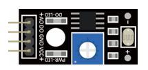

##############################################################################
Chapter Photoresistor & LED
##############################################################################

In this chapter, we will learn how to use a photoresistor to make an automatic dimming nightlight.

Project 8.1 NightLamp
****************************************************************

A Photoresistor is very sensitive to the amount of light present. We can take advantage of the characteristic to make a nightlight with the following function. When the ambient light is less (darker environment), the LED will automatically become brighter to compensate and when the ambient light is greater (brighter environment) the LED will automatically dim to compensate.

Component List
================================================================

+------------------------------------------+
| Freenove Projects Board for Raspberry Pi |
|                                          |
|  |Chapter01_04|                          |
+---------------------+--------------------+
| Raspberry Pi        | GPIO Ribbon Cable  |
|                     |                    |
|  |Chapter01_05|     |  |Chapter01_06|    |
+---------------------+--------------------+
| Jumper Wire         | Photoresistor      |
|                     |                    |
|  |Chapter05_02|     |  |Chapter08_00|    |
+---------------------+--------------------+

.. |Chapter01_04| image:: ../_static/imgs/1_LED/Chapter01_04.png
.. |Chapter01_05| image:: ../_static/imgs/1_LED/Chapter01_05.png
.. |Chapter01_06| image:: ../_static/imgs/1_LED/Chapter01_06.png
.. |Chapter05_02| image:: ../_static/imgs/5_RGB_LED/Chapter05_02.png

Circuit
================================================================

.. list-table:: 
    :width: 100%
    :align: center
    :class: product-table

    *   -   Schematic diagram
    *   -   |Chapter08_01|
    *   -   Hardware connection:
    *   -   |Chapter08_02|

.. |Chapter08_01| image:: ../_static/imgs/8_Photoresistor_&_LED/Chapter08_01.png
.. |Chapter08_02| image:: ../_static/imgs/8_Photoresistor_&_LED/Chapter08_02.png

.. note::
    
    :red:`If you have any concerns, please send an email to:` support@freenove.com

Code
================================================================

The code used in this project is identical with what was used in the last chapter.

C Code 8.1 Nightlamp
----------------------------------------------------------------

If you haven't configured I2C, please refer to :ref:`Chapter 7 <ADC>`. If you've done it, please continue.

First, observe the project result, and then learn about the code in detail.

.. note::
    
    :red:`If you have any concerns, please send an email to:` support@freenove.com

1.	Use cd command to enter 8_Nightlamp directory of C code.

.. code-block:: console

    $ cd ~/Freenove_Kit/Code/C_Code/8_Nightlamp

2.	Use following command to compile “Nightlamp.cpp” and generate executable file “Nightlamp”.

.. code-block:: console

    $ g++ Nightlamp.cpp -o Nightlamp -lwiringPi -lADCDevice

3.	Then run the generated file “Nightlamp”.

.. code-block:: console

    $ ./Nightlamp

After the program is executed, if you cover the Photoresistor or increase the light shining on it, the brightness of the LED changes accordingly. As in previous projects the Terminal window will display the current input voltage value of ADC module A1 pin and the converted digital quantity.

The following is the program code:

.. literalinclude:: ../../../freenove_Kit/Code/C_Code/8_Nightlamp/Nightlamp.cpp
    :linenos: 
    :language: c
    :dedent:

Python Code 8.1 Nightlamp
----------------------------------------------------------------

If you haven't configure I2C, please refer to :ref:`Chapter 7 <ADC>`. If you have done it, please continue.

First, observe the project result, and then learn about the code in detail. 

If you have any concerns, please send an email to: support@freenove.com

1.	Use cd command to enter 8_Nightlamp directory of Python code.

.. code-block:: console

    $ cd ~/Freenove_Kit/Code/Python_GPIOZero_Code/8_Nightlamp

2.	Use the python command to execute the Python code “Nightlamp.py”.

.. code-block:: console

    $ python Nightlamp.py

After the program is executed, if you cover the Photoresistor or increase the light shining on it, the brightness of the LED changes accordingly. As in previous projects the Terminal window will display the current input voltage value of ADC module A1 pin and the converted digital quantity.

The following is the program code:

.. literalinclude:: ../../../freenove_Kit/Code/Python_GPIOZero_Code/8_Nightlamp/Nightlamp.py
    :linenos: 
    :language: python
    :dedent: