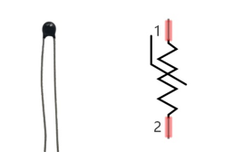

##############################################################################
Chapter Thermistor
##############################################################################

In this chapter, we will learn about Thermistors which are another kind of Resistor.

Project 9.1 Thermometer
****************************************************************

A Thermistor is a type of Resistor whose resistance value is dependent on temperature and changes in temperature. Therefore, we can take advantage of this characteristic to make a Thermometer.

Component knowledge
================================================================

Thermistor
----------------------------------------------------------------

Thermistor is a temperature sensitive resistor. When it senses a change in temperature, the resistance of the Thermistor will change. We can take advantage of this characteristic by using a Thermistor to detect temperature intensity. A Thermistor and its electronic symbol are shown below.

The relationship between resistance value and temperature of a thermistor is:

.. image:: ../_static/imgs/9_Thermistor/Chapter09_01.png
    :align: center

Rt=R*EXP [B*(1/T2-1/T1)]

Where:

    Rt is the thermistor resistance under T2 temperature;

    R is in the nominal resistance of thermistor under T1 temperature;

    EXP[n] is nth power of e;

    B is for thermal index;

    T1, T2 is Kelvin temperature (absolute temperature). Kelvin temperature=273.15 + Celsius temperature.

For the parameters of the Thermistor, we use: B=3950, R=10k, T1=25.

The circuit connection method of the Thermistor is similar to photoresistor, as the following:

.. image:: ../_static/imgs/9_Thermistor/Chapter09_02.png
    :align: center

We can use the value measured by the ADC converter to obtain the resistance value of Thermistor, and then we can use the formula to obtain the temperature value.

Therefore, the temperature formula can be derived as:

.. image:: ../_static/imgs/9_Thermistor/Chapter09_03.png
    :align: center

Component List
================================================================

+------------------------------------------+
| Freenove Projects Board for Raspberry Pi |
|                                          |
|  |Chapter01_04|                          |
+---------------------+--------------------+
| Raspberry Pi        | GPIO Ribbon Cable  |
|                     |                    |
|  |Chapter01_05|     |  |Chapter01_06|    |
+---------------------+--------------------+

.. |Chapter01_04| image:: ../_static/imgs/1_LED/Chapter01_04.png
.. |Chapter01_05| image:: ../_static/imgs/1_LED/Chapter01_05.png
.. |Chapter01_06| image:: ../_static/imgs/1_LED/Chapter01_06.png

Circuit
================================================================

.. list-table:: 
    :width: 100%
    :align: center
    :class: product-table

    *   -   Schematic diagram
    *   -   |Chapter09_04|
    *   -   Hardware connection:
    *   -   |Chapter09_05|

.. |Chapter09_04| image:: ../_static/imgs/9_Thermistor/Chapter09_04.png
.. |Chapter09_05| image:: ../_static/imgs/9_Thermistor/Chapter09_05.png

.. note::
    
    :red:`If you have any concerns, please send an email to:` support@freenove.com

Code
================================================================

In this project code, the ADC value still needs to be read, but the difference here is that a specific formula is used to calculate the temperature value.

C Code 9.1 Thermometer
----------------------------------------------------------------

If you haven't configure I2C, please refer to :ref:`Chapter 7 <ADC>`. If you've done it, please continue.

First, observe the project result, and then learn about the code in detail.

.. note::
    
    :red:`If you have any concerns, please send an email to:` support@freenove.com

1. Use cd command to enter 9_Thermometer directory of C code.

.. code-block:: console

    $ cd ~/Freenove_Kit/Code/C_Code/9_Thermometer

2. Use following command to compile “Thermometer.cpp” and generate executable file “Thermometer”.

.. code-block:: console

    $ g++ Thermometer.cpp -o Thermometer -lwiringPi -lADCDevice

3. Then run the generated file “Thermometer”.

.. code-block:: console

    $ ./Thermometer

After the program is executed, the Terminal window will display the current ADC value, voltage value and temperature value. Try to “pinch” the thermistor with your index finger and thumb for a brief time, you should see that the temperature value increases.

The following is the code:

.. literalinclude:: ../../../freenove_Kit/Code/C_Code/9_Thermometer/Thermometer.cpp
    :linenos: 
    :language: c

In the code, the ADC value of ADC module A0 port is read, and then calculates the voltage and the resistance of Thermistor according to Ohms Law. Finally, it calculates the temperature sensed by the Thermistor, according to the formula. 

Python Code 9.1 Thermometer
----------------------------------------------------------------

If you haven't configured I2C, please refer to :ref:`Chapter 7 <ADC>`. If you've done it, please continue.

First, observe the project result, and then learn about the code in detail.

.. note::
    
    :red:`If you have any concerns, please send an email to:` support@freenove.com

1.	Use cd command to enter 9_Thermometer directory of Python code.
+
.. code-block:: console

    $ cd ~/Freenove_Kit/Code/Python_GPIOZero_Code/9_Thermometer

2.	Use python command to execute Python code “Thermometer.py”.

.. code-block:: console

    $ python Thermometer.py

After the program is executed, the Terminal window will display the current ADC value, voltage value and temperature value. Try to “pinch” the thermistor with your index finger and thumb for a brief time, you should see that the temperature value increases.

The following is the code:

.. literalinclude:: ../../../freenove_Kit/Code/C_Code/9_Thermometer/Thermometer.py
    :linenos: 
    :language: python
